**Analyzing the 2019 NFL Season**

Daniel Zafman and Dennis Nazarov

**Introduction**

One of the most popular sports in the United States of America is football, commonly referred to as the National Football League (NFL). Millions of fans tune in every Sunday to watch their favorite sport, favorite team, and favorite players. Throughout the NFL, there are many statistics that help coaches, scouts, and fans analyze how well their respective teams are doing, such as the average amount of points scored, how many rushing yards a team allows, or how many passing yards a team has per game. This tutorial will explore the statistics and data of each team during the 2019 NFL season to help make conclusions on how different variables, such as passing yards, can impact each team differently. The data from the 2019 season will come from the “ProFootballReference” website: (https://www.pro-football-reference.com/years/2019/index.htm)

This tutorial will dive into how we utilized pandas to construct a refined table of each team’s statistics per game (16 games per team), such as by changing column names to develop a more representative data frame of what we are trying to analyze. It will also display how we used a combination of seaborn and matplotlib.pyplot to plot specific variables for each team, such as Passing Yards, Rushing Yards, Turnovers Allowed, and Rushing Yards Allowed, versus the points scored for that team. The tutorial will then analyze the results of these plots to conclude which variable has the highest impact against points scored, and how that impact varies across teams in the NFL.


```python
!conda install -y pandas
!conda install -y seaborn
!conda install -y scikit-learn
!conda install -y statsmodels
!conda install -y seaborn
!conda install -y nbconvert
import pandas as pd
from sklearn import linear_model
import statsmodels.api
import seaborn as sns 
import glob
import matplotlib.pyplot as plt
import numpy as np 
from sklearn import svm
from sklearn.model_selection import train_test_split
from mlxtend.evaluate import paired_ttest_kfold_cv
from sklearn.utils import shuffle
from sklearn.model_selection import *
from sklearn.ensemble import RandomForestRegressor
from sklearn.metrics import accuracy_score

```

    Collecting package metadata (current_repodata.json): done
    Solving environment: done
    
    
    ==> WARNING: A newer version of conda exists. <==
      current version: 4.8.3
      latest version: 4.9.2
    
    Please update conda by running
    
        $ conda update -n base conda
    
    
    
    ## Package Plan ##
    
      environment location: /opt/conda
    
      added / updated specs:
        - pandas
    
    
    The following packages will be downloaded:
    
        package                    |            build
        ---------------------------|-----------------
        ca-certificates-2020.12.5  |       ha878542_0         137 KB  conda-forge
        certifi-2020.12.5          |   py38h578d9bd_0         143 KB  conda-forge
        openssl-1.1.1i             |       h7f98852_0         2.1 MB  conda-forge
        pandas-1.1.5               |   py38h51da96c_0        11.5 MB  conda-forge
        ------------------------------------------------------------
                                               Total:        13.9 MB
    
    The following packages will be UPDATED:
    
      ca-certificates                      2020.6.20-hecda079_0 --> 2020.12.5-ha878542_0
      certifi                          2020.6.20-py38h32f6830_0 --> 2020.12.5-py38h578d9bd_0
      openssl                                 1.1.1g-h516909a_1 --> 1.1.1i-h7f98852_0
      pandas                               1.1.1-py38h950e882_0 --> 1.1.5-py38h51da96c_0
    
    
    
    Downloading and Extracting Packages
    certifi-2020.12.5    | 143 KB    | ##################################### | 100% 
    ca-certificates-2020 | 137 KB    | ##################################### | 100% 
    pandas-1.1.5         | 11.5 MB   | ##################################### | 100% 
    openssl-1.1.1i       | 2.1 MB    | ##################################### | 100% 
    Preparing transaction: done
    Verifying transaction: done
    Executing transaction: done
    Collecting package metadata (current_repodata.json): done
    Solving environment: done
    
    
    ==> WARNING: A newer version of conda exists. <==
      current version: 4.8.3
      latest version: 4.9.2
    
    Please update conda by running
    
        $ conda update -n base conda
    
    
    
    # All requested packages already installed.
    
    Collecting package metadata (current_repodata.json): done
    Solving environment: | 


**Getting the Data, Transforming it into a Dataframe, and Processing Data**

The first step of the process was to go to the 2019 NFL season data on https://www.pro-football-reference.com/years/2019/index.htm and press on each team. When pressing on each team, we saved each team’s statistics from all 16 games in a “csv” file. To read in each csv file and convert it into a pandas dataframe, we applied the function “read_csv”. We then applied a series of column name changes and drops to keep the data frame neater  as well as keep only the variables we care about. We first replaced the “Day” column from the original csv file to “Team Name” so viewers can easily see the relationship between each team and their data. Since we only care about certain variables, we dropped some variables, like “Date”, “Rec”, and “OT” using the pandas “drop” function. We then kept the variables we want to further analyze - (“ScoredPoints”, “FirstDowns”, “PassY”, “RushY, “TurnoversAllowed”, “FirstAllowed”, “YardsAllowed”, “PassYardsAllowed”, “RushingYardsAllowed”, and “Turnovers”).

```python

filenames = glob.glob('data_2019/*.csv')
li = []
for filename in filenames: 
    df = pd.read_csv(filename, index_col=None, header=0)
    filename = filename.replace('data_2019/', "")
    filename = filename.replace('.csv', '')
    df['Day'] = filename
    df.rename(columns= {'Day' : 'Team Name'}, inplace= True)
    df['Week'] = range(1, len(df) + 1)
    li.append(df)

team_stats_init = pd.concat(li, axis= 0, ignore_index=True)
team_stats_init.rename(columns= {team_stats_init.columns[9] : 'Against'}, inplace= True)
team_stats_init.drop(team_stats_init.columns[team_stats_init.columns.str.contains('unnamed',case = False)],axis = 1, inplace = True)
team_stats_init.drop(team_stats_init.columns[team_stats_init.columns.str.contains('opp',case = False)],axis = 1, inplace = True)

team_stats_init = team_stats_init.rename(columns = {team_stats_init.columns[6]: "ScoredPoints", team_stats_init.columns[7]: "FirstDowns", team_stats_init.columns[11]: "TurnoversAllowed",team_stats_init.columns[12] : "FirstAllowed", team_stats_init.columns[13] : "YardsAllowed", team_stats_init.columns[14]: "PassYardsAllowed", team_stats_init.columns[15]: "RushingYardsAllowed", team_stats_init.columns[16]: "Turnovers"})
team_stats_init.drop(team_stats_init.columns[team_stats_init.columns.str.contains('Date',case = False)],axis = 1, inplace = True)
team_stats_init.drop(team_stats_init.columns[team_stats_init.columns.str.contains('Rec',case = False)],axis = 1, inplace = True)
team_stats_init.drop(team_stats_init.columns[team_stats_init.columns.str.contains('OT',case = False)],axis = 1, inplace = True)
team_stats_init = team_stats_init.iloc[:, :13]
team_stats_init.to_csv(r"data_for_models/full_dataframe.csv")
team_stats_init.head(34)


```


<div>
<style scoped>
    .dataframe tbody tr th:only-of-type {
        vertical-align: middle;
    }

    .dataframe tbody tr th {
        vertical-align: top;
    }

    .dataframe thead th {
        text-align: right;
    }
</style>
<table border="1" class="dataframe">
  <thead>
    <tr style="text-align: right;">
      <th></th>
      <th>Week</th>
      <th>Team Name</th>
      <th>Against</th>
      <th>ScoredPoints</th>
      <th>FirstDowns</th>
      <th>PassY</th>
      <th>RushY</th>
      <th>TurnoversAllowed</th>
      <th>FirstAllowed</th>
      <th>YardsAllowed</th>
      <th>PassYardsAllowed</th>
      <th>RushingYardsAllowed</th>
      <th>Turnovers</th>
    </tr>
  </thead>
  <tbody>
    <tr>
      <th>0</th>
      <td>1</td>
      <td>Steelers</td>
      <td>New England Patriots</td>
      <td>3.0</td>
      <td>15.0</td>
      <td>276.0</td>
      <td>32.0</td>
      <td>1.0</td>
      <td>24.0</td>
      <td>465.0</td>
      <td>366.0</td>
      <td>99.0</td>
      <td>NaN</td>
    </tr>
    <tr>
      <th>1</th>
      <td>2</td>
      <td>Steelers</td>
      <td>Seattle Seahawks</td>
      <td>26.0</td>
      <td>17.0</td>
      <td>180.0</td>
      <td>81.0</td>
      <td>1.0</td>
      <td>25.0</td>
      <td>425.0</td>
      <td>274.0</td>
      <td>151.0</td>
      <td>2.0</td>
    </tr>
    <tr>
      <th>2</th>
      <td>3</td>
      <td>Steelers</td>
      <td>San Francisco 49ers</td>
      <td>20.0</td>
      <td>11.0</td>
      <td>160.0</td>
      <td>79.0</td>
      <td>2.0</td>
      <td>26.0</td>
      <td>436.0</td>
      <td>268.0</td>
      <td>168.0</td>
      <td>5.0</td>
    </tr>
    <tr>
      <th>3</th>
      <td>4</td>
      <td>Steelers</td>
      <td>Cincinnati Bengals</td>
      <td>27.0</td>
      <td>20.0</td>
      <td>260.0</td>
      <td>66.0</td>
      <td>1.0</td>
      <td>16.0</td>
      <td>175.0</td>
      <td>102.0</td>
      <td>73.0</td>
      <td>2.0</td>
    </tr>
    <tr>
      <th>4</th>
      <td>5</td>
      <td>Steelers</td>
      <td>Baltimore Ravens</td>
      <td>23.0</td>
      <td>18.0</td>
      <td>192.0</td>
      <td>77.0</td>
      <td>2.0</td>
      <td>22.0</td>
      <td>277.0</td>
      <td>139.0</td>
      <td>138.0</td>
      <td>3.0</td>
    </tr>
    <tr>
      <th>5</th>
      <td>6</td>
      <td>Steelers</td>
      <td>Los Angeles Chargers</td>
      <td>24.0</td>
      <td>18.0</td>
      <td>132.0</td>
      <td>124.0</td>
      <td>1.0</td>
      <td>23.0</td>
      <td>348.0</td>
      <td>316.0</td>
      <td>32.0</td>
      <td>3.0</td>
    </tr>
    <tr>
      <th>6</th>
      <td>7</td>
      <td>Steelers</td>
      <td>Bye Week</td>
      <td>NaN</td>
      <td>NaN</td>
      <td>NaN</td>
      <td>NaN</td>
      <td>NaN</td>
      <td>NaN</td>
      <td>NaN</td>
      <td>NaN</td>
      <td>NaN</td>
      <td>NaN</td>
    </tr>
    <tr>
      <th>7</th>
      <td>8</td>
      <td>Steelers</td>
      <td>Miami Dolphins</td>
      <td>27.0</td>
      <td>21.0</td>
      <td>236.0</td>
      <td>158.0</td>
      <td>1.0</td>
      <td>16.0</td>
      <td>230.0</td>
      <td>170.0</td>
      <td>60.0</td>
      <td>4.0</td>
    </tr>
    <tr>
      <th>8</th>
      <td>9</td>
      <td>Steelers</td>
      <td>Indianapolis Colts</td>
      <td>26.0</td>
      <td>17.0</td>
      <td>183.0</td>
      <td>90.0</td>
      <td>2.0</td>
      <td>22.0</td>
      <td>328.0</td>
      <td>189.0</td>
      <td>139.0</td>
      <td>3.0</td>
    </tr>
    <tr>
      <th>9</th>
      <td>10</td>
      <td>Steelers</td>
      <td>Los Angeles Rams</td>
      <td>17.0</td>
      <td>15.0</td>
      <td>231.0</td>
      <td>42.0</td>
      <td>2.0</td>
      <td>16.0</td>
      <td>306.0</td>
      <td>218.0</td>
      <td>88.0</td>
      <td>4.0</td>
    </tr>
    <tr>
      <th>10</th>
      <td>11</td>
      <td>Steelers</td>
      <td>Cleveland Browns</td>
      <td>7.0</td>
      <td>18.0</td>
      <td>178.0</td>
      <td>58.0</td>
      <td>4.0</td>
      <td>17.0</td>
      <td>293.0</td>
      <td>189.0</td>
      <td>104.0</td>
      <td>NaN</td>
    </tr>
    <tr>
      <th>11</th>
      <td>12</td>
      <td>Steelers</td>
      <td>Cincinnati Bengals</td>
      <td>16.0</td>
      <td>16.0</td>
      <td>179.0</td>
      <td>159.0</td>
      <td>1.0</td>
      <td>11.0</td>
      <td>244.0</td>
      <td>158.0</td>
      <td>86.0</td>
      <td>2.0</td>
    </tr>
    <tr>
      <th>12</th>
      <td>13</td>
      <td>Steelers</td>
      <td>Cleveland Browns</td>
      <td>20.0</td>
      <td>18.0</td>
      <td>199.0</td>
      <td>124.0</td>
      <td>1.0</td>
      <td>19.0</td>
      <td>279.0</td>
      <td>173.0</td>
      <td>106.0</td>
      <td>2.0</td>
    </tr>
    <tr>
      <th>13</th>
      <td>14</td>
      <td>Steelers</td>
      <td>Arizona Cardinals</td>
      <td>23.0</td>
      <td>20.0</td>
      <td>135.0</td>
      <td>140.0</td>
      <td>2.0</td>
      <td>17.0</td>
      <td>236.0</td>
      <td>165.0</td>
      <td>71.0</td>
      <td>3.0</td>
    </tr>
    <tr>
      <th>14</th>
      <td>15</td>
      <td>Steelers</td>
      <td>Buffalo Bills</td>
      <td>10.0</td>
      <td>15.0</td>
      <td>178.0</td>
      <td>51.0</td>
      <td>5.0</td>
      <td>17.0</td>
      <td>261.0</td>
      <td>131.0</td>
      <td>130.0</td>
      <td>2.0</td>
    </tr>
    <tr>
      <th>15</th>
      <td>16</td>
      <td>Steelers</td>
      <td>New York Jets</td>
      <td>10.0</td>
      <td>16.0</td>
      <td>185.0</td>
      <td>75.0</td>
      <td>2.0</td>
      <td>14.0</td>
      <td>259.0</td>
      <td>174.0</td>
      <td>85.0</td>
      <td>1.0</td>
    </tr>
    <tr>
      <th>16</th>
      <td>17</td>
      <td>Steelers</td>
      <td>Baltimore Ravens</td>
      <td>10.0</td>
      <td>10.0</td>
      <td>77.0</td>
      <td>91.0</td>
      <td>2.0</td>
      <td>19.0</td>
      <td>304.0</td>
      <td>81.0</td>
      <td>223.0</td>
      <td>2.0</td>
    </tr>
    <tr>
      <th>17</th>
      <td>1</td>
      <td>Patriots</td>
      <td>Pittsburgh Steelers</td>
      <td>33.0</td>
      <td>24.0</td>
      <td>366.0</td>
      <td>99.0</td>
      <td>NaN</td>
      <td>15.0</td>
      <td>308.0</td>
      <td>276.0</td>
      <td>32.0</td>
      <td>1.0</td>
    </tr>
    <tr>
      <th>18</th>
      <td>2</td>
      <td>Patriots</td>
      <td>Miami Dolphins</td>
      <td>43.0</td>
      <td>27.0</td>
      <td>255.0</td>
      <td>124.0</td>
      <td>1.0</td>
      <td>11.0</td>
      <td>184.0</td>
      <td>142.0</td>
      <td>42.0</td>
      <td>4.0</td>
    </tr>
    <tr>
      <th>19</th>
      <td>3</td>
      <td>Patriots</td>
      <td>New York Jets</td>
      <td>30.0</td>
      <td>21.0</td>
      <td>313.0</td>
      <td>68.0</td>
      <td>2.0</td>
      <td>6.0</td>
      <td>105.0</td>
      <td>69.0</td>
      <td>36.0</td>
      <td>1.0</td>
    </tr>
    <tr>
      <th>20</th>
      <td>4</td>
      <td>Patriots</td>
      <td>Buffalo Bills</td>
      <td>16.0</td>
      <td>11.0</td>
      <td>150.0</td>
      <td>74.0</td>
      <td>1.0</td>
      <td>23.0</td>
      <td>375.0</td>
      <td>240.0</td>
      <td>135.0</td>
      <td>4.0</td>
    </tr>
    <tr>
      <th>21</th>
      <td>5</td>
      <td>Patriots</td>
      <td>Washington Redskins</td>
      <td>33.0</td>
      <td>23.0</td>
      <td>312.0</td>
      <td>130.0</td>
      <td>1.0</td>
      <td>11.0</td>
      <td>223.0</td>
      <td>78.0</td>
      <td>145.0</td>
      <td>2.0</td>
    </tr>
    <tr>
      <th>22</th>
      <td>6</td>
      <td>Patriots</td>
      <td>New York Giants</td>
      <td>35.0</td>
      <td>27.0</td>
      <td>313.0</td>
      <td>114.0</td>
      <td>2.0</td>
      <td>10.0</td>
      <td>213.0</td>
      <td>161.0</td>
      <td>52.0</td>
      <td>4.0</td>
    </tr>
    <tr>
      <th>23</th>
      <td>7</td>
      <td>Patriots</td>
      <td>New York Jets</td>
      <td>33.0</td>
      <td>22.0</td>
      <td>249.0</td>
      <td>74.0</td>
      <td>1.0</td>
      <td>12.0</td>
      <td>154.0</td>
      <td>73.0</td>
      <td>81.0</td>
      <td>6.0</td>
    </tr>
    <tr>
      <th>24</th>
      <td>8</td>
      <td>Patriots</td>
      <td>Cleveland Browns</td>
      <td>27.0</td>
      <td>19.0</td>
      <td>239.0</td>
      <td>79.0</td>
      <td>NaN</td>
      <td>15.0</td>
      <td>310.0</td>
      <td>151.0</td>
      <td>159.0</td>
      <td>3.0</td>
    </tr>
    <tr>
      <th>25</th>
      <td>9</td>
      <td>Patriots</td>
      <td>Baltimore Ravens</td>
      <td>20.0</td>
      <td>22.0</td>
      <td>268.0</td>
      <td>74.0</td>
      <td>2.0</td>
      <td>26.0</td>
      <td>372.0</td>
      <td>162.0</td>
      <td>210.0</td>
      <td>2.0</td>
    </tr>
    <tr>
      <th>26</th>
      <td>10</td>
      <td>Patriots</td>
      <td>Bye Week</td>
      <td>NaN</td>
      <td>NaN</td>
      <td>NaN</td>
      <td>NaN</td>
      <td>NaN</td>
      <td>NaN</td>
      <td>NaN</td>
      <td>NaN</td>
      <td>NaN</td>
      <td>NaN</td>
    </tr>
    <tr>
      <th>27</th>
      <td>11</td>
      <td>Patriots</td>
      <td>Philadelphia Eagles</td>
      <td>17.0</td>
      <td>19.0</td>
      <td>224.0</td>
      <td>74.0</td>
      <td>NaN</td>
      <td>21.0</td>
      <td>255.0</td>
      <td>174.0</td>
      <td>81.0</td>
      <td>1.0</td>
    </tr>
    <tr>
      <th>28</th>
      <td>12</td>
      <td>Patriots</td>
      <td>Dallas Cowboys</td>
      <td>13.0</td>
      <td>17.0</td>
      <td>181.0</td>
      <td>101.0</td>
      <td>NaN</td>
      <td>16.0</td>
      <td>321.0</td>
      <td>212.0</td>
      <td>109.0</td>
      <td>1.0</td>
    </tr>
    <tr>
      <th>29</th>
      <td>13</td>
      <td>Patriots</td>
      <td>Houston Texans</td>
      <td>22.0</td>
      <td>29.0</td>
      <td>303.0</td>
      <td>145.0</td>
      <td>1.0</td>
      <td>16.0</td>
      <td>276.0</td>
      <td>224.0</td>
      <td>52.0</td>
      <td>NaN</td>
    </tr>
    <tr>
      <th>30</th>
      <td>14</td>
      <td>Patriots</td>
      <td>Kansas City Chiefs</td>
      <td>16.0</td>
      <td>17.0</td>
      <td>184.0</td>
      <td>94.0</td>
      <td>1.0</td>
      <td>20.0</td>
      <td>346.0</td>
      <td>271.0</td>
      <td>75.0</td>
      <td>2.0</td>
    </tr>
    <tr>
      <th>31</th>
      <td>15</td>
      <td>Patriots</td>
      <td>Cincinnati Bengals</td>
      <td>34.0</td>
      <td>19.0</td>
      <td>116.0</td>
      <td>175.0</td>
      <td>NaN</td>
      <td>19.0</td>
      <td>315.0</td>
      <td>151.0</td>
      <td>164.0</td>
      <td>5.0</td>
    </tr>
    <tr>
      <th>32</th>
      <td>16</td>
      <td>Patriots</td>
      <td>Buffalo Bills</td>
      <td>24.0</td>
      <td>23.0</td>
      <td>271.0</td>
      <td>143.0</td>
      <td>1.0</td>
      <td>14.0</td>
      <td>268.0</td>
      <td>176.0</td>
      <td>92.0</td>
      <td>NaN</td>
    </tr>
    <tr>
      <th>33</th>
      <td>17</td>
      <td>Patriots</td>
      <td>Miami Dolphins</td>
      <td>24.0</td>
      <td>18.0</td>
      <td>217.0</td>
      <td>135.0</td>
      <td>2.0</td>
      <td>26.0</td>
      <td>389.0</td>
      <td>326.0</td>
      <td>63.0</td>
      <td>NaN</td>
    </tr>
  </tbody>
</table>
</div>


**Determining/Plotting which variables correlate to a team's score

After the data frame was cleaned, we then created a linear regression model to determine which 4 variables correlate to a team’s score. To do this, we leveraged sklearn statsmodels for every variable against the score for each entry in the dataframe. In this case, our null hypothesis would be that a given variable, for example, passing yards, does not impact a team’s score in a football game. We found that a team’s passing yards, rushing yards, allowed turnovers, and rushing yards allowed to the opposing team had the smallest p-values compared to the rest of the statistics, all having p-values under 1.0 E-6. This tells us that we must reject the null hypothesis that these 4 variables do not have an impact on a team’s score, meaning we can predict a team’s score based on those 4 variables/predictors. 


```python
for col in team_stats_init.iloc[:, 4:].columns:
    
    lin_reg_test =statsmodels.formula.api.ols(formula="ScoredPoints ~ {}".format(col), data=team_stats_init).fit()
    print(lin_reg_test.summary())


```

                                OLS Regression Results                            
    ==============================================================================
    Dep. Variable:           ScoredPoints   R-squared:                       0.339
    Model:                            OLS   Adj. R-squared:                  0.337
    Method:                 Least Squares   F-statistic:                     261.1
    Date:                Fri, 18 Dec 2020   Prob (F-statistic):           1.01e-47
    Time:                        17:52:28   Log-Likelihood:                -1807.0
    No. Observations:                 512   AIC:                             3618.
    Df Residuals:                     510   BIC:                             3627.
    Df Model:                           1                                         
    Covariance Type:            nonrobust                                         
    ==============================================================================
                     coef    std err          t      P>|t|      [0.025      0.975]
    ------------------------------------------------------------------------------
    Intercept     -1.2316      1.532     -0.804      0.422      -4.242       1.779
    FirstDowns     1.1873      0.073     16.157      0.000       1.043       1.332
    ==============================================================================
    Omnibus:                        4.757   Durbin-Watson:                   1.940
    Prob(Omnibus):                  0.093   Jarque-Bera (JB):                4.849
    Skew:                           0.232   Prob(JB):                       0.0885
    Kurtosis:                       2.891   Cond. No.                         87.6
    ==============================================================================
    
    Notes:
    [1] Standard Errors assume that the covariance matrix of the errors is correctly specified.
                                OLS Regression Results                            
    ==============================================================================
    Dep. Variable:           ScoredPoints   R-squared:                       0.212
    Model:                            OLS   Adj. R-squared:                  0.211
    Method:                 Least Squares   F-statistic:                     137.5
    Date:                Fri, 18 Dec 2020   Prob (F-statistic):           2.75e-28
    Time:                        17:52:28   Log-Likelihood:                -1851.7
    No. Observations:                 512   AIC:                             3707.
    Df Residuals:                     510   BIC:                             3716.
    Df Model:                           1                                         
    Covariance Type:            nonrobust                                         
    ==============================================================================
                     coef    std err          t      P>|t|      [0.025      0.975]
    ------------------------------------------------------------------------------
    Intercept      8.9269      1.249      7.145      0.000       6.472      11.381
    PassY          0.0591      0.005     11.728      0.000       0.049       0.069
    ==============================================================================
    Omnibus:                       10.881   Durbin-Watson:                   1.854
    Prob(Omnibus):                  0.004   Jarque-Bera (JB):               10.972
    Skew:                           0.350   Prob(JB):                      0.00414
    Kurtosis:                       3.156   Cond. No.                         777.
    ==============================================================================
    
    Notes:
    [1] Standard Errors assume that the covariance matrix of the errors is correctly specified.
                                OLS Regression Results                            
    ==============================================================================
    Dep. Variable:           ScoredPoints   R-squared:                       0.169
    Model:                            OLS   Adj. R-squared:                  0.167
    Method:                 Least Squares   F-statistic:                     103.7
    Date:                Fri, 18 Dec 2020   Prob (F-statistic):           2.66e-22
    Time:                        17:52:28   Log-Likelihood:                -1865.5
    No. Observations:                 512   AIC:                             3735.
    Df Residuals:                     510   BIC:                             3743.
    Df Model:                           1                                         
    Covariance Type:            nonrobust                                         
    ==============================================================================
                     coef    std err          t      P>|t|      [0.025      0.975]
    ------------------------------------------------------------------------------
    Intercept     13.8616      0.970     14.297      0.000      11.957      15.767
    RushY          0.0793      0.008     10.185      0.000       0.064       0.095
    ==============================================================================
    Omnibus:                        7.428   Durbin-Watson:                   1.841
    Prob(Omnibus):                  0.024   Jarque-Bera (JB):                7.621
    Skew:                           0.293   Prob(JB):                       0.0221
    Kurtosis:                       2.882   Cond. No.                         295.
    ==============================================================================
    
    Notes:
    [1] Standard Errors assume that the covariance matrix of the errors is correctly specified.
                                OLS Regression Results                            
    ==============================================================================
    Dep. Variable:           ScoredPoints   R-squared:                       0.066
    Model:                            OLS   Adj. R-squared:                  0.064
    Method:                 Least Squares   F-statistic:                     26.45
    Date:                Fri, 18 Dec 2020   Prob (F-statistic):           4.38e-07
    Time:                        17:52:28   Log-Likelihood:                -1384.9
    No. Observations:                 375   AIC:                             2774.
    Df Residuals:                     373   BIC:                             2782.
    Df Model:                           1                                         
    Covariance Type:            nonrobust                                         
    ====================================================================================
                           coef    std err          t      P>|t|      [0.025      0.975]
    ------------------------------------------------------------------------------------
    Intercept           25.9521      0.989     26.240      0.000      24.007      27.897
    TurnoversAllowed    -2.3095      0.449     -5.143      0.000      -3.193      -1.426
    ==============================================================================
    Omnibus:                        3.168   Durbin-Watson:                   1.761
    Prob(Omnibus):                  0.205   Jarque-Bera (JB):                3.086
    Skew:                           0.222   Prob(JB):                        0.214
    Kurtosis:                       3.001   Cond. No.                         5.02
    ==============================================================================
    
    Notes:
    [1] Standard Errors assume that the covariance matrix of the errors is correctly specified.
                                OLS Regression Results                            
    ==============================================================================
    Dep. Variable:           ScoredPoints   R-squared:                       0.002
    Model:                            OLS   Adj. R-squared:                 -0.000
    Method:                 Least Squares   F-statistic:                    0.9937
    Date:                Fri, 18 Dec 2020   Prob (F-statistic):              0.319
    Time:                        17:52:28   Log-Likelihood:                -1912.4
    No. Observations:                 512   AIC:                             3829.
    Df Residuals:                     510   BIC:                             3837.
    Df Model:                           1                                         
    Covariance Type:            nonrobust                                         
    ================================================================================
                       coef    std err          t      P>|t|      [0.025      0.975]
    --------------------------------------------------------------------------------
    Intercept       20.9902      1.882     11.151      0.000      17.292      24.688
    FirstAllowed     0.0900      0.090      0.997      0.319      -0.087       0.267
    ==============================================================================
    Omnibus:                        4.942   Durbin-Watson:                   1.793
    Prob(Omnibus):                  0.084   Jarque-Bera (JB):                4.877
    Skew:                           0.239   Prob(JB):                       0.0873
    Kurtosis:                       3.022   Cond. No.                         87.6
    ==============================================================================
    
    Notes:
    [1] Standard Errors assume that the covariance matrix of the errors is correctly specified.
                                OLS Regression Results                            
    ==============================================================================
    Dep. Variable:           ScoredPoints   R-squared:                       0.000
    Model:                            OLS   Adj. R-squared:                 -0.002
    Method:                 Least Squares   F-statistic:                  0.001539
    Date:                Fri, 18 Dec 2020   Prob (F-statistic):              0.969
    Time:                        17:52:28   Log-Likelihood:                -1912.9
    No. Observations:                 512   AIC:                             3830.
    Df Residuals:                     510   BIC:                             3838.
    Df Model:                           1                                         
    Covariance Type:            nonrobust                                         
    ================================================================================
                       coef    std err          t      P>|t|      [0.025      0.975]
    --------------------------------------------------------------------------------
    Intercept       22.7432      1.823     12.473      0.000      19.161      26.325
    YardsAllowed     0.0002      0.005      0.039      0.969      -0.010       0.010
    ==============================================================================
    Omnibus:                        4.887   Durbin-Watson:                   1.805
    Prob(Omnibus):                  0.087   Jarque-Bera (JB):                4.859
    Skew:                           0.239   Prob(JB):                       0.0881
    Kurtosis:                       2.998   Cond. No.                     1.46e+03
    ==============================================================================
    
    Notes:
    [1] Standard Errors assume that the covariance matrix of the errors is correctly specified.
    [2] The condition number is large, 1.46e+03. This might indicate that there are
    strong multicollinearity or other numerical problems.
                                OLS Regression Results                            
    ==============================================================================
    Dep. Variable:           ScoredPoints   R-squared:                       0.023
    Model:                            OLS   Adj. R-squared:                  0.021
    Method:                 Least Squares   F-statistic:                     12.02
    Date:                Fri, 18 Dec 2020   Prob (F-statistic):           0.000571
    Time:                        17:52:28   Log-Likelihood:                -1906.9
    No. Observations:                 512   AIC:                             3818.
    Df Residuals:                     510   BIC:                             3826.
    Df Model:                           1                                         
    Covariance Type:            nonrobust                                         
    ====================================================================================
                           coef    std err          t      P>|t|      [0.025      0.975]
    ------------------------------------------------------------------------------------
    Intercept           18.2406      1.391     13.109      0.000      15.507      20.974
    PassYardsAllowed     0.0195      0.006      3.467      0.001       0.008       0.030
    ==============================================================================
    Omnibus:                        4.771   Durbin-Watson:                   1.760
    Prob(Omnibus):                  0.092   Jarque-Bera (JB):                4.590
    Skew:                           0.225   Prob(JB):                        0.101
    Kurtosis:                       3.109   Cond. No.                         777.
    ==============================================================================
    
    Notes:
    [1] Standard Errors assume that the covariance matrix of the errors is correctly specified.
                                OLS Regression Results                            
    ==============================================================================
    Dep. Variable:           ScoredPoints   R-squared:                       0.051
    Model:                            OLS   Adj. R-squared:                  0.049
    Method:                 Least Squares   F-statistic:                     27.27
    Date:                Fri, 18 Dec 2020   Prob (F-statistic):           2.59e-07
    Time:                        17:52:28   Log-Likelihood:                -1899.5
    No. Observations:                 512   AIC:                             3803.
    Df Residuals:                     510   BIC:                             3812.
    Df Model:                           1                                         
    Covariance Type:            nonrobust                                         
    =======================================================================================
                              coef    std err          t      P>|t|      [0.025      0.975]
    ---------------------------------------------------------------------------------------
    Intercept              27.7172      1.036     26.747      0.000      25.681      29.753
    RushingYardsAllowed    -0.0434      0.008     -5.222      0.000      -0.060      -0.027
    ==============================================================================
    Omnibus:                        2.397   Durbin-Watson:                   1.835
    Prob(Omnibus):                  0.302   Jarque-Bera (JB):                2.330
    Skew:                           0.165   Prob(JB):                        0.312
    Kurtosis:                       3.004   Cond. No.                         295.
    ==============================================================================
    
    Notes:
    [1] Standard Errors assume that the covariance matrix of the errors is correctly specified.
                                OLS Regression Results                            
    ==============================================================================
    Dep. Variable:           ScoredPoints   R-squared:                       0.052
    Model:                            OLS   Adj. R-squared:                  0.049
    Method:                 Least Squares   F-statistic:                     20.33
    Date:                Fri, 18 Dec 2020   Prob (F-statistic):           8.74e-06
    Time:                        17:52:28   Log-Likelihood:                -1395.8
    No. Observations:                 375   AIC:                             2796.
    Df Residuals:                     373   BIC:                             2803.
    Df Model:                           1                                         
    Covariance Type:            nonrobust                                         
    ==============================================================================
                     coef    std err          t      P>|t|      [0.025      0.975]
    ------------------------------------------------------------------------------
    Intercept     20.2936      1.018     19.933      0.000      18.292      22.296
    Turnovers      2.0843      0.462      4.509      0.000       1.175       2.993
    ==============================================================================
    Omnibus:                        3.190   Durbin-Watson:                   1.724
    Prob(Omnibus):                  0.203   Jarque-Bera (JB):                3.128
    Skew:                           0.224   Prob(JB):                        0.209
    Kurtosis:                       2.989   Cond. No.                         5.02
    ==============================================================================
    
    Notes:
    [1] Standard Errors assume that the covariance matrix of the errors is correctly specified.

**Plotting the 4 Variables that correlate best with a higher score for each team**

After determining which 4 variables had the highest impact on score based on their respective p-values, we concluded that “PassY” (Passing Yards), “RushY” (Rushing Yards), “TurnoversAllowed”, and “RushingYardsAllowed” had the best correlation with a high score. We then utilized the seaborn library with the matlplotlib.pyplot library to plot each of these 4 variables versus points scored for each team. 

```python
#Plotting variables that have high correlation to scoring
cnt = 1
for title, group in team_stats_init.groupby('Team Name'):
    plt.figure(cnt)
    sns.regplot(x= 'PassY', y= 'ScoredPoints', data= group)
    plt.title(title)
    cnt += 1
    plt.figure(cnt)
    sns.regplot(x= 'RushY', y= 'ScoredPoints', data= group)
    plt.title(title)
    cnt += 1
    plt.figure(cnt)
    sns.regplot(x= 'TurnoversAllowed', y= 'ScoredPoints', data= group)
    plt.title(title)
    cnt += 1
    plt.figure(cnt)
    sns.regplot(x= 'RushingYardsAllowed', y= 'ScoredPoints', data= group)
    plt.title(title)
    cnt += 1


```


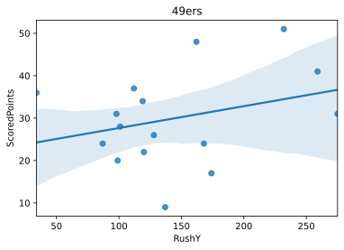


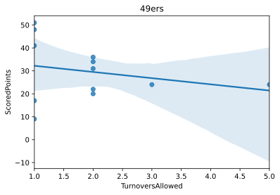


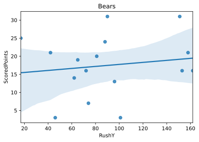


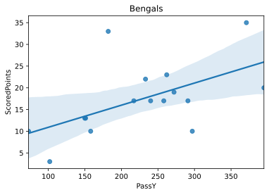


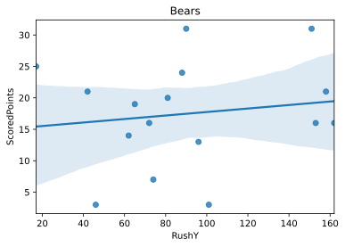


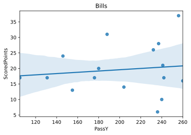


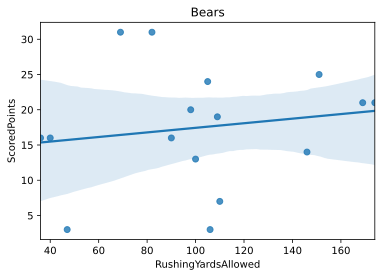


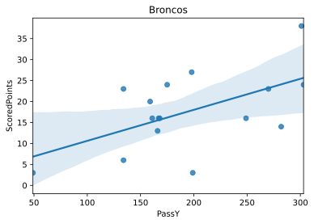


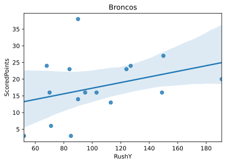


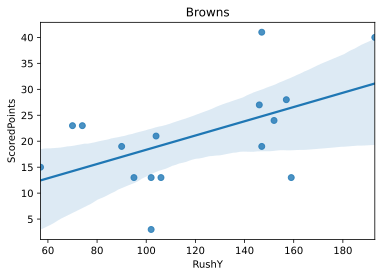


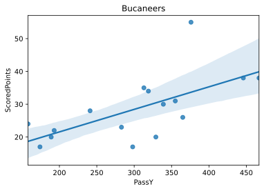


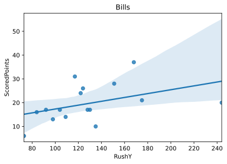


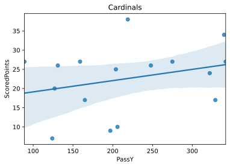


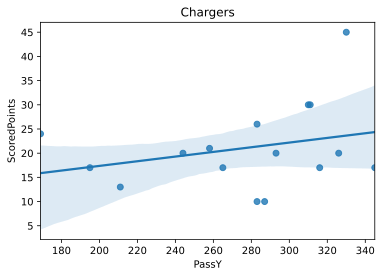


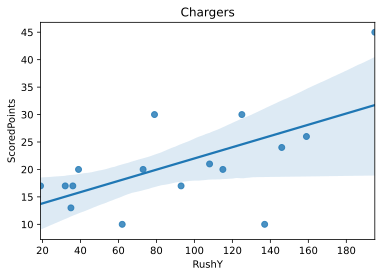


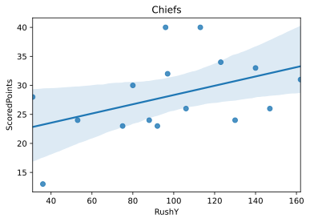


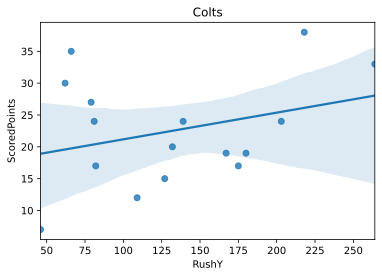


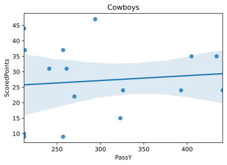


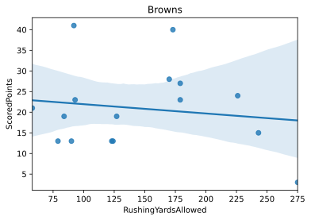


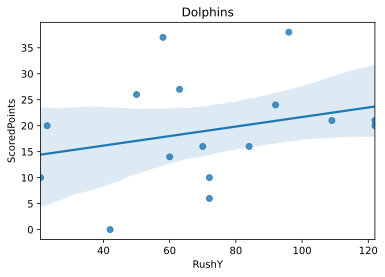


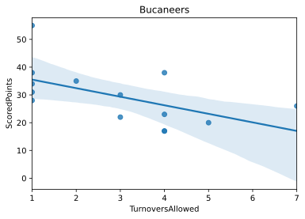


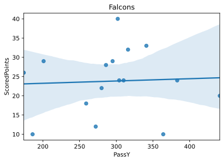


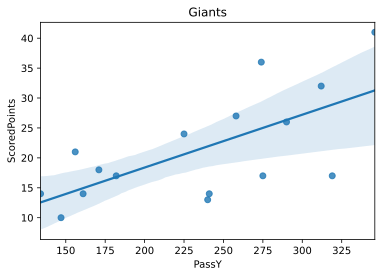


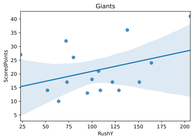


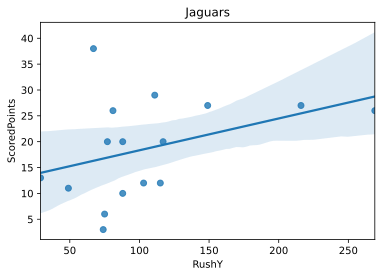


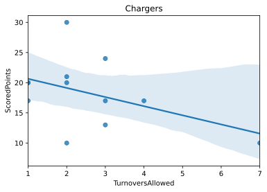


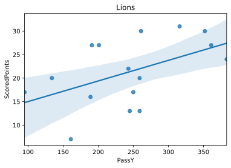


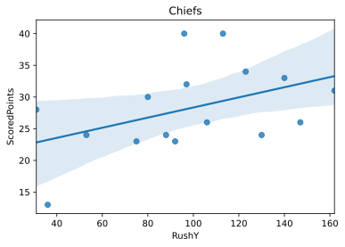


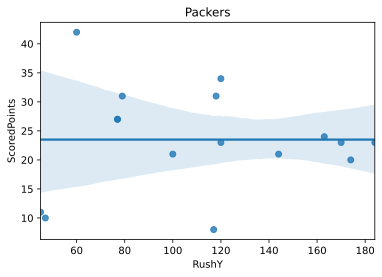


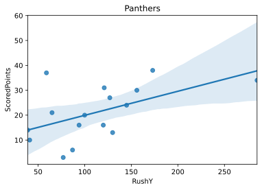


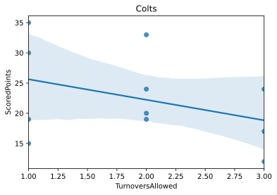


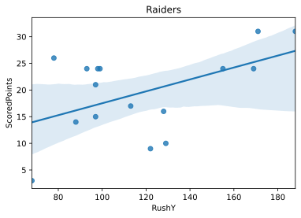


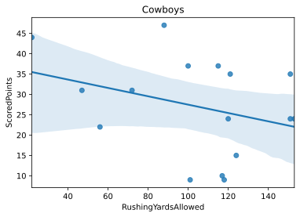


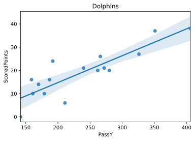


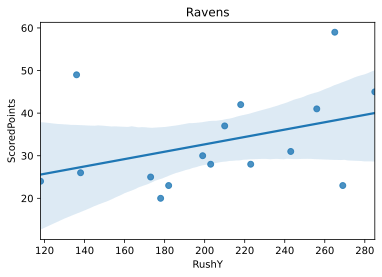


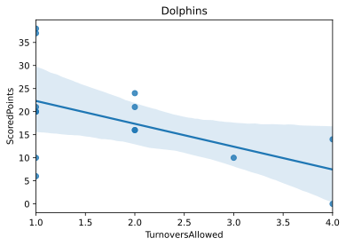


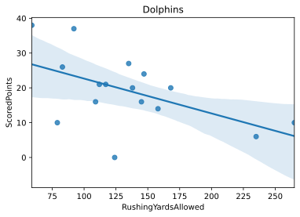


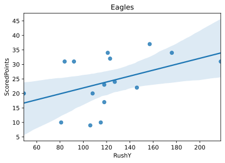


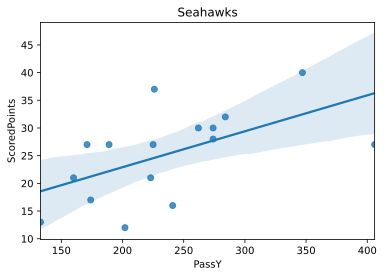


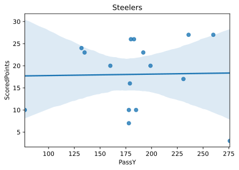


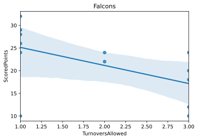


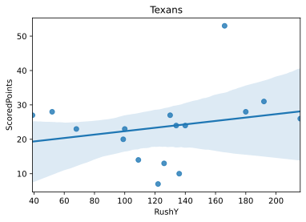


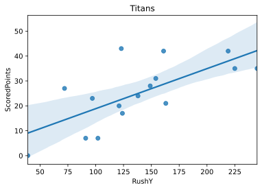


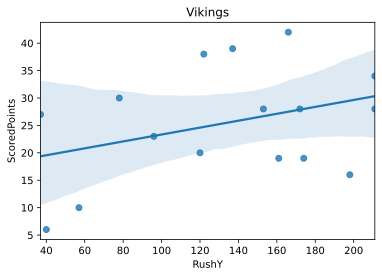


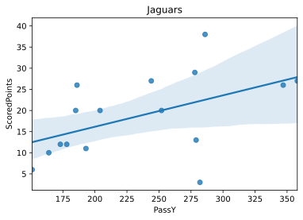


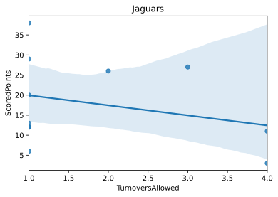


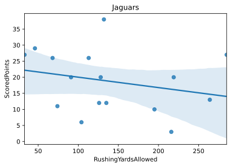


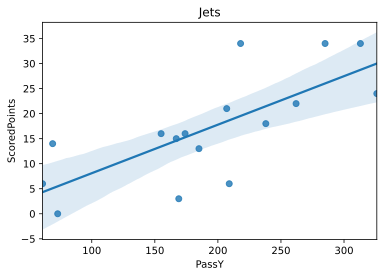


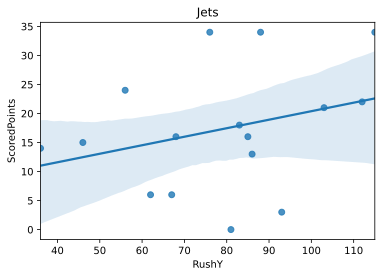


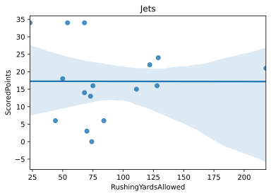


**Plotting 4 graphs for each variable across all 32 teams in the National Football League (NFL)**

To do this, we also combined the use of the seaborn and matplotlib.pyplot library to plot each of the four variables versus points scored for all 32 teams. Unlike the previous part that plotted each team individually, these four graphs were able to show us an overall trend across all NFL teams on how Passing Yards, Rushing Yards, Turnovers Allowed, and Rushing Yards Allowed impact the points scored by a team. For example, taking a closer look at the first plot which graphs Passing Yards versus Points Scored, the steep positive slope indicates that in general, when a NFL team throws for more yards, they will end up scoring more points. On the other hand, if you look at the third plot which graphs Turnovers Allowed versus Points Scored, the negative slope indicates that in general, when a NFL team allows more turnovers, they will end up scoring less points. 

```python
#Plotting combined statistics across all teams

Pass_Yards = sns.lmplot(x= 'PassY', y= 'ScoredPoints', palette= sns.color_palette("Paired"), hue= 'Team Name',data= team_stats_init, height= 8, fit_reg= False)
sns.regplot(x="PassY", y="ScoredPoints", data=team_stats_init, scatter=False, ax= Pass_Yards.axes[0, 0], line_kws={"color": "black"})
plt.xlabel("Passing Yards")
plt.ylabel("Points Scored")
plt.title("Points Scored vs Pass Yards Across All NFL Teams in the 2019 Season")

Rush_Yards = sns.lmplot(x= 'RushY', y= 'ScoredPoints', palette= sns.color_palette("Paired"), hue= 'Team Name',data= team_stats_init, height= 8, fit_reg= False)
sns.regplot(x="RushY", y="ScoredPoints", data=team_stats_init, scatter=False, ax= Rush_Yards.axes[0, 0], line_kws={"color": "black"})
plt.xlabel("Rushing Yards")
plt.ylabel("Points Scored")
plt.title("Points Scored vs Rush Yards Across All NFL Teams in the 2019 Season")

Turnovers_Allowed = sns.lmplot(x= 'TurnoversAllowed', y= 'ScoredPoints', palette= sns.color_palette("Paired"), hue= 'Team Name',data= team_stats_init, height= 8, fit_reg= False)
sns.regplot(x="TurnoversAllowed", y="ScoredPoints", data=team_stats_init, scatter=False, ax= Turnovers_Allowed.axes[0, 0], line_kws={"color": "black"})
plt.xlabel("Turnovers Allowed")
plt.ylabel("Points Scored")
plt.title("Points Scored vs Turnovers Allowed Across All NFL Teams in the 2019 Season")

Rushing_Yards_Allowed = sns.lmplot(x= 'RushingYardsAllowed', y= 'ScoredPoints', palette= sns.color_palette("Paired"), hue= 'Team Name',data= team_stats_init, height= 8, fit_reg= False)
sns.regplot(x="RushingYardsAllowed", y="ScoredPoints", data=team_stats_init, scatter=False, ax= Rushing_Yards_Allowed.axes[0, 0], line_kws={"color": "black"})
plt.xlabel("Rushing Yards Allowed")
plt.ylabel("Points Scored")
plt.title("Points Scored vs Rushing Yards Allowed Across All NFL Teams in the 2019 Season")

```


    Text(0.5, 1.0, 'Points Scored vs Rushing Yards Allowed Across All NFL Teams in the 2019 Season')


**Determining Predictors in a Given Week**

Of course, when predicting a team’s score in a game, we will not know the pass yards, rush yards, turnovers, and rushing yards allowed until that game is already completed. This posed a challenge for us, as we cannot train a machine learning model without those 4 predictors given. To resolve this issue, we chose to use average passing yards, rushing yards, turnovers allowed, and rushing yards allowed up until that week. For example, if the Baltimore Ravens passed for 300 yards in the first week of the season and 100 yards in the second week, we would predict that the Ravens would pass for 200 yards in the third week of the season. Since we cannot use this method to expect predictors in the first week of the season, we chose to ignore predicting values in the first week of the season. Intuitively, we would expect that as the more games a team plays, the estimated predictors would become more accurate to the actual predictors.
Using the averages of previous weeks to predict our variables, we can estimate what would expect a team’s passing yards, rushing yards, turnovers allowed, and rushing yards allowed to be.

**Our Implementation of a New DataFrame of Expected Variables**

The above part conveyed how since we don’t know the values of the variables until a football game is over, we chose to calculate the averages of the previous weeks’ data to help predict our 4 variables: Passing Yards, Rushing Yards, Turnovers Allowed, and Rushing Yards. We then stored these averages under new column names in our new dataframe called “test_train_data”. These new column names were: “Expected Pass Yards”, “Expected Rushing Yards”, “Expected Turnovers Allowed”, and “Expected Rushing Yards Allowed”. From our original dataframe, we used the “Team Name” and “ScoredPoints” columns in our new dataframe as we still want to analyze how our calculated Expected values correlate to the points scored by a team.


**Constructing column for "Expected Pass Yards" in the new Dataframe**
```python
test_train_data = pd.DataFrame(columns=['Team Name', 'Scored Points', 'Expected Pass Yards'])
for title, group in team_stats_init.groupby('Team Name'):
  
    series = group.iloc[:, 5:6]
    values = pd.DataFrame(series.values)
    averages = {}
    lst = []
    add_to_subset = {}
    for index in range(values.shape[0]):
        if index > 0:
            ele = values.iloc[:index, :].mean(numeric_only= True)
            lst.append(ele.values[0])
        else:
            lst.append(0)

    averages[0] = lst
    averages = pd.DataFrame(averages)
    averages.replace(0, np.nan, inplace=True)
    averages.columns = ['Expected Pass Yards']

    add_to_subset['Team Name'] = [title] * 17
    add_to_subset = pd.DataFrame(add_to_subset, columns = ["Team Name"])
    add_to_subset['Scored Points'] = group['ScoredPoints'].values
    add_to_subset['Opponent'] = group['Against'].values
    add_to_subset['Expected Pass Yards'] = averages['Expected Pass Yards']
    
    test_train_data = pd.concat([test_train_data, add_to_subset], ignore_index = True)
    
    


```

**Constructing column for "Expected Rushing Yards" in the new Dataframe**
```python
rushing_column = pd.DataFrame(columns= ["Expected Rushing Yards"])
for title, group in team_stats_init.groupby('Team Name'):
  
    series = group.iloc[:, 6:7]
    values = pd.DataFrame(series.values)
    averages = {}
    lst = []
    add_to_subset = {}
    for index in range(values.shape[0]):
        if index > 0:
            ele = values.iloc[:index, :].mean(numeric_only= True)
            lst.append(ele.values[0])
        else:
            lst.append(0)

    averages[0] = lst
    averages = pd.DataFrame(averages)
    averages.replace(0, np.nan, inplace=True)
    averages.columns = ['Expected Rushing Yards']
    add_to_subset['Expected Rushing Yards'] = averages['Expected Rushing Yards'].values
    
    add_to_subset = pd.DataFrame(add_to_subset, columns = ["Expected Rushing Yards"])

    rushing_column = pd.concat([rushing_column, add_to_subset])
    

test_train_data["Expected Rushing Yards"] = rushing_column['Expected Rushing Yards'].values


```

**Constructing column for "Expected Turnovers Allowed" in the new Dataframe**
```python
turnovers_column = pd.DataFrame(columns= ["Expected Turnovers Allowed"])

for title, group in team_stats_init.groupby('Team Name'):
  
    series = group.iloc[:, 7:8]
    values = pd.DataFrame(series.values)
    averages = {}
    lst = []
    add_to_subset = {}
    for index in range(values.shape[0]):
        if index > 0:
            ele = values.iloc[:index, :].mean(numeric_only= True)
            lst.append(ele.values[0])
        else:
            lst.append(0)

    averages[0] = lst
    averages = pd.DataFrame(averages)
    averages.replace(0, np.nan, inplace=True)
    averages.columns = ['Expected Turnovers Allowed']
    add_to_subset['Expected Turnovers Allowed'] = averages['Expected Turnovers Allowed'].values
    
    add_to_subset = pd.DataFrame(add_to_subset, columns = ["Expected Turnovers Allowed"])

    turnovers_column = pd.concat([turnovers_column, add_to_subset])
    

test_train_data["Expected Turnovers Allowed"] = turnovers_column['Expected Turnovers Allowed'].values
```

**Constructing column for "Expected Rushing Yards Allowed" in the new Dataframe**
```python
rushing_allowed_column = pd.DataFrame(columns= ["Expected Rushing Yards Allowed"])
for title, group in team_stats_init.groupby('Team Name'):
  
    series = group.iloc[:, 11:12]
    values = pd.DataFrame(series.values)
    averages = {}
    lst = []
    add_to_subset = {}
    for index in range(values.shape[0]):
        if index > 0:
            ele = values.iloc[:index, :].mean(numeric_only= True)
            lst.append(ele.values[0])
        else:
            lst.append(0)

    averages[0] = lst
    averages = pd.DataFrame(averages)
    averages.replace(0, np.nan, inplace=True)
    averages.columns = ['Expected Rushing Yards Allowed']
    add_to_subset['Expected Rushing Yards Allowed'] = averages['Expected Rushing Yards Allowed'].values
    
    add_to_subset = pd.DataFrame(add_to_subset, columns = ["Expected Rushing Yards Allowed"])

    rushing_allowed_column = pd.concat([rushing_allowed_column, add_to_subset])
    

test_train_data["Expected Rushing Yards Allowed"] = rushing_allowed_column['Expected Rushing Yards Allowed'].values
test_train_data['Weeks'] = team_stats_init['Week']
test_train_data.to_csv(r"data_for_models/test_train_data.csv")
test_train_data.head(34)
```


<div>
<style scoped>
    .dataframe tbody tr th:only-of-type {
        vertical-align: middle;
    }

    .dataframe tbody tr th {
        vertical-align: top;
    }

    .dataframe thead th {
        text-align: right;
    }
</style>
<table border="1" class="dataframe">
  <thead>
    <tr style="text-align: right;">
      <th></th>
      <th>Team Name</th>
      <th>Scored Points</th>
      <th>Expected Pass Yards</th>
      <th>Opponent</th>
      <th>Expected Rushing Yards</th>
      <th>Expected Turnovers Allowed</th>
      <th>Expected Rushing Yards Allowed</th>
      <th>Weeks</th>
    </tr>
  </thead>
  <tbody>
    <tr>
      <th>0</th>
      <td>49ers</td>
      <td>31.0</td>
      <td>NaN</td>
      <td>Tampa Bay Buccaneers</td>
      <td>NaN</td>
      <td>NaN</td>
      <td>NaN</td>
      <td>1</td>
    </tr>
    <tr>
      <th>1</th>
      <td>49ers</td>
      <td>41.0</td>
      <td>158.000000</td>
      <td>Cincinnati Bengals</td>
      <td>98.000000</td>
      <td>2.000000</td>
      <td>121.000000</td>
      <td>2</td>
    </tr>
    <tr>
      <th>2</th>
      <td>49ers</td>
      <td>24.0</td>
      <td>235.000000</td>
      <td>Pittsburgh Steelers</td>
      <td>178.500000</td>
      <td>1.500000</td>
      <td>73.000000</td>
      <td>3</td>
    </tr>
    <tr>
      <th>3</th>
      <td>49ers</td>
      <td>NaN</td>
      <td>246.000000</td>
      <td>Bye Week</td>
      <td>175.000000</td>
      <td>2.666667</td>
      <td>75.000000</td>
      <td>4</td>
    </tr>
    <tr>
      <th>4</th>
      <td>49ers</td>
      <td>31.0</td>
      <td>246.000000</td>
      <td>Cleveland Browns</td>
      <td>175.000000</td>
      <td>2.666667</td>
      <td>75.000000</td>
      <td>5</td>
    </tr>
    <tr>
      <th>5</th>
      <td>49ers</td>
      <td>20.0</td>
      <td>227.250000</td>
      <td>Los Angeles Rams</td>
      <td>200.000000</td>
      <td>2.666667</td>
      <td>81.750000</td>
      <td>6</td>
    </tr>
    <tr>
      <th>6</th>
      <td>49ers</td>
      <td>9.0</td>
      <td>228.200000</td>
      <td>Washington Redskins</td>
      <td>179.800000</td>
      <td>2.500000</td>
      <td>87.200000</td>
      <td>7</td>
    </tr>
    <tr>
      <th>7</th>
      <td>49ers</td>
      <td>51.0</td>
      <td>214.500000</td>
      <td>Carolina Panthers</td>
      <td>172.666667</td>
      <td>2.200000</td>
      <td>90.000000</td>
      <td>8</td>
    </tr>
    <tr>
      <th>8</th>
      <td>49ers</td>
      <td>28.0</td>
      <td>206.142857</td>
      <td>Arizona Cardinals</td>
      <td>181.142857</td>
      <td>2.000000</td>
      <td>95.714286</td>
      <td>9</td>
    </tr>
    <tr>
      <th>9</th>
      <td>49ers</td>
      <td>24.0</td>
      <td>219.125000</td>
      <td>Seattle Seahawks</td>
      <td>171.125000</td>
      <td>2.000000</td>
      <td>102.875000</td>
      <td>10</td>
    </tr>
    <tr>
      <th>10</th>
      <td>49ers</td>
      <td>36.0</td>
      <td>218.666667</td>
      <td>Arizona Cardinals</td>
      <td>161.777778</td>
      <td>2.142857</td>
      <td>107.777778</td>
      <td>11</td>
    </tr>
    <tr>
      <th>11</th>
      <td>49ers</td>
      <td>37.0</td>
      <td>237.600000</td>
      <td>Green Bay Packers</td>
      <td>149.000000</td>
      <td>2.125000</td>
      <td>110.500000</td>
      <td>12</td>
    </tr>
    <tr>
      <th>12</th>
      <td>49ers</td>
      <td>17.0</td>
      <td>236.636364</td>
      <td>Baltimore Ravens</td>
      <td>145.636364</td>
      <td>2.125000</td>
      <td>111.090909</td>
      <td>13</td>
    </tr>
    <tr>
      <th>13</th>
      <td>49ers</td>
      <td>48.0</td>
      <td>230.000000</td>
      <td>New Orleans Saints</td>
      <td>148.000000</td>
      <td>2.000000</td>
      <td>116.666667</td>
      <td>14</td>
    </tr>
    <tr>
      <th>14</th>
      <td>49ers</td>
      <td>22.0</td>
      <td>239.538462</td>
      <td>Atlanta Falcons</td>
      <td>149.076923</td>
      <td>1.900000</td>
      <td>116.615385</td>
      <td>15</td>
    </tr>
    <tr>
      <th>15</th>
      <td>49ers</td>
      <td>34.0</td>
      <td>236.214286</td>
      <td>Los Angeles Rams</td>
      <td>147.000000</td>
      <td>1.909091</td>
      <td>114.642857</td>
      <td>16</td>
    </tr>
    <tr>
      <th>16</th>
      <td>49ers</td>
      <td>26.0</td>
      <td>234.800000</td>
      <td>Seattle Seahawks</td>
      <td>145.133333</td>
      <td>1.916667</td>
      <td>111.800000</td>
      <td>17</td>
    </tr>
    <tr>
      <th>17</th>
      <td>Bears</td>
      <td>3.0</td>
      <td>NaN</td>
      <td>Green Bay Packers</td>
      <td>NaN</td>
      <td>NaN</td>
      <td>NaN</td>
      <td>1</td>
    </tr>
    <tr>
      <th>18</th>
      <td>Bears</td>
      <td>16.0</td>
      <td>208.000000</td>
      <td>Denver Broncos</td>
      <td>46.000000</td>
      <td>1.000000</td>
      <td>47.000000</td>
      <td>2</td>
    </tr>
    <tr>
      <th>19</th>
      <td>Bears</td>
      <td>31.0</td>
      <td>164.000000</td>
      <td>Washington Redskins</td>
      <td>99.500000</td>
      <td>1.000000</td>
      <td>68.500000</td>
      <td>3</td>
    </tr>
    <tr>
      <th>20</th>
      <td>Bears</td>
      <td>16.0</td>
      <td>178.666667</td>
      <td>Minnesota Vikings</td>
      <td>96.333333</td>
      <td>1.000000</td>
      <td>68.666667</td>
      <td>4</td>
    </tr>
    <tr>
      <th>21</th>
      <td>Bears</td>
      <td>21.0</td>
      <td>183.250000</td>
      <td>Oakland Raiders</td>
      <td>90.250000</td>
      <td>1.000000</td>
      <td>61.500000</td>
      <td>5</td>
    </tr>
    <tr>
      <th>22</th>
      <td>Bears</td>
      <td>NaN</td>
      <td>185.400000</td>
      <td>Bye Week</td>
      <td>80.600000</td>
      <td>1.333333</td>
      <td>83.000000</td>
      <td>6</td>
    </tr>
    <tr>
      <th>23</th>
      <td>Bears</td>
      <td>25.0</td>
      <td>185.400000</td>
      <td>New Orleans Saints</td>
      <td>80.600000</td>
      <td>1.333333</td>
      <td>83.000000</td>
      <td>7</td>
    </tr>
    <tr>
      <th>24</th>
      <td>Bears</td>
      <td>16.0</td>
      <td>193.666667</td>
      <td>Los Angeles Chargers</td>
      <td>70.000000</td>
      <td>1.500000</td>
      <td>94.333333</td>
      <td>8</td>
    </tr>
    <tr>
      <th>25</th>
      <td>Bears</td>
      <td>14.0</td>
      <td>198.285714</td>
      <td>Philadelphia Eagles</td>
      <td>83.142857</td>
      <td>1.600000</td>
      <td>86.000000</td>
      <td>9</td>
    </tr>
    <tr>
      <th>26</th>
      <td>Bears</td>
      <td>20.0</td>
      <td>186.250000</td>
      <td>Detroit Lions</td>
      <td>80.500000</td>
      <td>1.500000</td>
      <td>93.500000</td>
      <td>10</td>
    </tr>
    <tr>
      <th>27</th>
      <td>Bears</td>
      <td>7.0</td>
      <td>181.666667</td>
      <td>Los Angeles Rams</td>
      <td>80.555556</td>
      <td>1.500000</td>
      <td>94.000000</td>
      <td>11</td>
    </tr>
    <tr>
      <th>28</th>
      <td>Bears</td>
      <td>19.0</td>
      <td>182.800000</td>
      <td>New York Giants</td>
      <td>79.900000</td>
      <td>1.428571</td>
      <td>95.600000</td>
      <td>12</td>
    </tr>
    <tr>
      <th>29</th>
      <td>Bears</td>
      <td>24.0</td>
      <td>190.727273</td>
      <td>Detroit Lions</td>
      <td>78.545455</td>
      <td>1.500000</td>
      <td>96.818182</td>
      <td>13</td>
    </tr>
    <tr>
      <th>30</th>
      <td>Bears</td>
      <td>31.0</td>
      <td>202.416667</td>
      <td>Dallas Cowboys</td>
      <td>79.333333</td>
      <td>1.444444</td>
      <td>97.500000</td>
      <td>14</td>
    </tr>
    <tr>
      <th>31</th>
      <td>Bears</td>
      <td>13.0</td>
      <td>204.615385</td>
      <td>Green Bay Packers</td>
      <td>84.846154</td>
      <td>1.500000</td>
      <td>96.307692</td>
      <td>15</td>
    </tr>
    <tr>
      <th>32</th>
      <td>Bears</td>
      <td>3.0</td>
      <td>212.785714</td>
      <td>Kansas City Chiefs</td>
      <td>85.642857</td>
      <td>1.636364</td>
      <td>96.571429</td>
      <td>16</td>
    </tr>
    <tr>
      <th>33</th>
      <td>Bears</td>
      <td>21.0</td>
      <td>207.466667</td>
      <td>Minnesota Vikings</td>
      <td>86.666667</td>
      <td>1.636364</td>
      <td>97.200000</td>
      <td>17</td>
    </tr>
  </tbody>
</table>
</div>


**Training a Random Forest Regression using the 4 Expected Variables and the Actual Scored Points**

To predict the accuracy of our four expected variables that we calculated using the averages from previous weeks in the NFL season versus the amount of points scored, we chose to train a Random Forest Regression on this data. We utilized the “RandomForestRegression” class within the sklearn.ensemble library to perform a Random Forest Regression on our training data. After training the Random Forest Regression model with this data, we created a new dataframe with our predicted scores using the X_test dataframe, and created a second column in the dataframe of the Y_test, to display a side-by-side comparison of predicted versus expected scores.

```python
test_train_data.fillna(test_train_data.mean(), inplace=True)


X = test_train_data[["Expected Pass Yards", "Expected Rushing Yards", "Expected Turnovers Allowed", "Expected Rushing Yards Allowed"]]
y = np.ravel(test_train_data[['Scored Points']])
X_train, X_test, y_train, y_test = train_test_split(X,y,random_state = 0)
clf = RandomForestRegressor(max_depth=1000, random_state=1)

clf.fit(X_train, y_train)
score_train = clf.score(X_test,y_test)

print(score_train)


```

    0.050855778359101045

**Plotting Expected Values versus Predicted Values**

To plot this, we used matplotlib.pyplot and seaborn to plot the expected values we discovered versus the predicted values. If our model produced 100% accuracy, meaning the expected values identically matched the predicted values, the slope would have been 1 in the plot. If you take a closer look at the plot, the slight, positive slope indicates that although our expected values didn’t exactly match our predicted values, the Random Forest Regression was a great training model for our dataset. 

```python
p1 = sns.regplot(x = y_test, y= clf.predict(X_test))
plt.xlabel("Expected")
plt.ylabel("Predicted")
plt.title("Predicted Score vs. Expected Score")
```


    Text(0.5, 1.0, 'Predicted Score vs. Expected Score')


```python
final_df = pd.DataFrame(columns= ["ExpectedPointsScored", "ActualPointsScored"])
final_df['ExpectedPointsScored'] = clf.predict(X_test)
final_df['ActualPointsScored'] = y_test
lin_reg_test = statsmodels.formula.api.ols(formula="ExpectedPointsScored ~ ActualPointsScored", data=final_df).fit()
print(lin_reg_test.summary())
```

                                 OLS Regression Results                             
    ================================================================================
    Dep. Variable:     ExpectedPointsScored   R-squared:                       0.081
    Model:                              OLS   Adj. R-squared:                  0.074
    Method:                   Least Squares   F-statistic:                     11.75
    Date:                  Fri, 18 Dec 2020   Prob (F-statistic):           0.000807
    Time:                          17:53:24   Log-Likelihood:                -382.51
    No. Observations:                   136   AIC:                             769.0
    Df Residuals:                       134   BIC:                             774.8
    Df Model:                             1                                         
    Covariance Type:              nonrobust                                         
    ======================================================================================
                             coef    std err          t      P>|t|      [0.025      0.975]
    --------------------------------------------------------------------------------------
    Intercept             20.2314      0.865     23.383      0.000      18.520      21.943
    ActualPointsScored     0.1229      0.036      3.428      0.001       0.052       0.194
    ==============================================================================
    Omnibus:                        3.979   Durbin-Watson:                   2.022
    Prob(Omnibus):                  0.137   Jarque-Bera (JB):                3.643
    Skew:                           0.398   Prob(JB):                        0.162
    Kurtosis:                       3.098   Cond. No.                         60.1
    ==============================================================================
    
    Notes:
    [1] Standard Errors assume that the covariance matrix of the errors is correctly specified.


```python
final_df.head(20)

```


<div>
<style scoped>
    .dataframe tbody tr th:only-of-type {
        vertical-align: middle;
    }

    .dataframe tbody tr th {
        vertical-align: top;
    }

    .dataframe thead th {
        text-align: right;
    }
</style>
<table border="1" class="dataframe">
  <thead>
    <tr style="text-align: right;">
      <th></th>
      <th>ExpectedPointsScored</th>
      <th>ActualPointsScored</th>
    </tr>
  </thead>
  <tbody>
    <tr>
      <th>0</th>
      <td>14.140521</td>
      <td>24.0000</td>
    </tr>
    <tr>
      <th>1</th>
      <td>31.840000</td>
      <td>35.0000</td>
    </tr>
    <tr>
      <th>2</th>
      <td>22.986875</td>
      <td>27.0000</td>
    </tr>
    <tr>
      <th>3</th>
      <td>18.202188</td>
      <td>17.0000</td>
    </tr>
    <tr>
      <th>4</th>
      <td>22.822510</td>
      <td>20.0000</td>
    </tr>
    <tr>
      <th>5</th>
      <td>19.958125</td>
      <td>20.0000</td>
    </tr>
    <tr>
      <th>6</th>
      <td>21.972717</td>
      <td>3.0000</td>
    </tr>
    <tr>
      <th>7</th>
      <td>19.920000</td>
      <td>27.0000</td>
    </tr>
    <tr>
      <th>8</th>
      <td>17.050000</td>
      <td>22.8125</td>
    </tr>
    <tr>
      <th>9</th>
      <td>15.277917</td>
      <td>3.0000</td>
    </tr>
    <tr>
      <th>10</th>
      <td>21.509350</td>
      <td>24.0000</td>
    </tr>
    <tr>
      <th>11</th>
      <td>20.802708</td>
      <td>10.0000</td>
    </tr>
    <tr>
      <th>12</th>
      <td>18.438125</td>
      <td>30.0000</td>
    </tr>
    <tr>
      <th>13</th>
      <td>29.700000</td>
      <td>6.0000</td>
    </tr>
    <tr>
      <th>14</th>
      <td>19.560625</td>
      <td>33.0000</td>
    </tr>
    <tr>
      <th>15</th>
      <td>20.290771</td>
      <td>27.0000</td>
    </tr>
    <tr>
      <th>16</th>
      <td>21.848625</td>
      <td>27.0000</td>
    </tr>
    <tr>
      <th>17</th>
      <td>28.950000</td>
      <td>35.0000</td>
    </tr>
    <tr>
      <th>18</th>
      <td>22.056094</td>
      <td>28.0000</td>
    </tr>
    <tr>
      <th>19</th>
      <td>21.734870</td>
      <td>22.8125</td>
    </tr>
  </tbody>
</table>
</div>


**Assessing the Accuracy of the Random Forest Regression**

We cannot use classification score methods to assess the accuracy of our model because we have to compare continuous variables. As a result, we first created a new column in our dataframe of the absolute difference between the expected and predicted scores. We then created a function that outputted a dataframe of all of the scores that were within a set tolerance, for example, of all of the test data, how many score predictions were within 1 point. We divided the length of this dataframe by the total number of score predictions to give us an accuracy score. Within 1 point, our model predicted with 9 percent accuracy, however, by setting a tolerance of 1 touchdown (7 points), we were able to predict a score with about 52 percent accuracy. 

```python
final_df['Differences'] = abs(final_df['ActualPointsScored']- final_df['ExpectedPointsScored'])

details = final_df.apply(lambda x : True
            if x['Differences'] <= 7 else False, axis = 1) 
num_rows = len(final_df[details == True].index)
print(num_rows/ len(final_df))


```

    0.5220588235294118


```python

```
