**Introduction**

One of the most popular sports in the United States of America is football, commonly referred to as the National Football League (NFL). Millions of fans tune in every Sunday to watch their favorite sport, favorite team, and favorite players. Throughout the NFL, there are many statistics that help coaches, scouts, and fans analyze how well their respective teams are doing, such as the average amount of points scored, how many rushing yards a team allows, or how many passing yards a team has per game. This tutorial will explore the statistics and data of each team during the 2019 NFL season to help make conclusions on how different variables, such as passing yards, can impact each team differently. The data from the 2019 season will come from the “ProFootballReference” website, specifically: https://www.pro-football-reference.com/years/2019/index.htm

This tutorial will dive into how we utilized pandas to construct a refined table of each team’s statistics per game (16 games per team), such as by changing column names to develop a more representative data frame of what we are trying to analyze. It will also display how we used a combination of seaborn and matplotlib.pyplot to plot specific variables for each team, such as Passing Yards, Rushing Yards, Turnovers Allowed, and Rushing Yards Allowed, versus the points scored for that team. The tutorial will then analyze the results of these plots to conclude which variable has the highest impact against points scored, and how that impact varies across teams in the NFL. 


```python
!conda install -y pandas
!conda install -y seaborn
!conda install -y scikit-learn
!conda install -y statsmodels
!conda install -y seaborn
!conda install -y nbconvert
import pandas as pd
from sklearn import linear_model
import statsmodels.api
import seaborn as sns 
import glob
import matplotlib.pyplot as plt
import numpy as np 
from sklearn import svm
from sklearn.model_selection import train_test_split
from mlxtend.evaluate import paired_ttest_kfold_cv
from sklearn.utils import shuffle
from sklearn.model_selection import *
from sklearn.ensemble import RandomForestRegressor
from sklearn.metrics import mean_squared_error

```


```python

filenames = glob.glob('data_2019/*.csv')
li = []
for filename in filenames: 
    df = pd.read_csv(filename, index_col=None, header=0)
    filename = filename.replace('data_2019/', "")
    filename = filename.replace('.csv', '')
    df['Day'] = filename
    df.rename(columns= {'Day' : 'Team Name'}, inplace= True)
    df['Week'] = range(1, len(df) + 1)
    li.append(df)

team_stats_init = pd.concat(li, axis= 0, ignore_index=True)

team_stats_init.drop(team_stats_init.columns[team_stats_init.columns.str.contains('unnamed',case = False)],axis = 1, inplace = True)
team_stats_init.drop(team_stats_init.columns[team_stats_init.columns.str.contains('opp',case = False)],axis = 1, inplace = True)


team_stats_init = team_stats_init.rename(columns = {team_stats_init.columns[5]: "ScoredPoints", team_stats_init.columns[6]: "FirstDowns", team_stats_init.columns[10]: "TurnoversAllowed",team_stats_init.columns[11] : "FirstAllowed", team_stats_init.columns[12] : "YardsAllowed", team_stats_init.columns[12]: "YardsAllowed", team_stats_init.columns[13]: "PassYardsAllowed", team_stats_init.columns[14]: "RushingYardsAllowed", team_stats_init.columns[15]: "Turnovers"})
team_stats_init.drop(team_stats_init.columns[team_stats_init.columns.str.contains('Date',case = False)],axis = 1, inplace = True)
team_stats_init.drop(team_stats_init.columns[team_stats_init.columns.str.contains('Rec',case = False)],axis = 1, inplace = True)
team_stats_init.drop(team_stats_init.columns[team_stats_init.columns.str.contains('OT',case = False)],axis = 1, inplace = True)
team_stats_init = team_stats_init.iloc[:, :12]
team_stats_init.to_csv(r"data_for_models/full_dataframe.csv")
team_stats_init.head(34)


```


<div>
<style scoped>
    .dataframe tbody tr th:only-of-type {
        vertical-align: middle;
    }

    .dataframe tbody tr th {
        vertical-align: top;
    }

    .dataframe thead th {
        text-align: right;
    }
</style>
<table border="1" class="dataframe">
  <thead>
    <tr style="text-align: right;">
      <th></th>
      <th>Week</th>
      <th>Team Name</th>
      <th>ScoredPoints</th>
      <th>FirstDowns</th>
      <th>PassY</th>
      <th>RushY</th>
      <th>TurnoversAllowed</th>
      <th>FirstAllowed</th>
      <th>YardsAllowed</th>
      <th>PassYardsAllowed</th>
      <th>RushingYardsAllowed</th>
      <th>Turnovers</th>
    </tr>
  </thead>
  <tbody>
    <tr>
      <th>0</th>
      <td>1</td>
      <td>Steelers</td>
      <td>3.0</td>
      <td>15.0</td>
      <td>276.0</td>
      <td>32.0</td>
      <td>1.0</td>
      <td>24.0</td>
      <td>465.0</td>
      <td>366.0</td>
      <td>99.0</td>
      <td>NaN</td>
    </tr>
    <tr>
      <th>1</th>
      <td>2</td>
      <td>Steelers</td>
      <td>26.0</td>
      <td>17.0</td>
      <td>180.0</td>
      <td>81.0</td>
      <td>1.0</td>
      <td>25.0</td>
      <td>425.0</td>
      <td>274.0</td>
      <td>151.0</td>
      <td>2.0</td>
    </tr>
    <tr>
      <th>2</th>
      <td>3</td>
      <td>Steelers</td>
      <td>20.0</td>
      <td>11.0</td>
      <td>160.0</td>
      <td>79.0</td>
      <td>2.0</td>
      <td>26.0</td>
      <td>436.0</td>
      <td>268.0</td>
      <td>168.0</td>
      <td>5.0</td>
    </tr>
    <tr>
      <th>3</th>
      <td>4</td>
      <td>Steelers</td>
      <td>27.0</td>
      <td>20.0</td>
      <td>260.0</td>
      <td>66.0</td>
      <td>1.0</td>
      <td>16.0</td>
      <td>175.0</td>
      <td>102.0</td>
      <td>73.0</td>
      <td>2.0</td>
    </tr>
    <tr>
      <th>4</th>
      <td>5</td>
      <td>Steelers</td>
      <td>23.0</td>
      <td>18.0</td>
      <td>192.0</td>
      <td>77.0</td>
      <td>2.0</td>
      <td>22.0</td>
      <td>277.0</td>
      <td>139.0</td>
      <td>138.0</td>
      <td>3.0</td>
    </tr>
    <tr>
      <th>5</th>
      <td>6</td>
      <td>Steelers</td>
      <td>24.0</td>
      <td>18.0</td>
      <td>132.0</td>
      <td>124.0</td>
      <td>1.0</td>
      <td>23.0</td>
      <td>348.0</td>
      <td>316.0</td>
      <td>32.0</td>
      <td>3.0</td>
    </tr>
    <tr>
      <th>6</th>
      <td>7</td>
      <td>Steelers</td>
      <td>NaN</td>
      <td>NaN</td>
      <td>NaN</td>
      <td>NaN</td>
      <td>NaN</td>
      <td>NaN</td>
      <td>NaN</td>
      <td>NaN</td>
      <td>NaN</td>
      <td>NaN</td>
    </tr>
    <tr>
      <th>7</th>
      <td>8</td>
      <td>Steelers</td>
      <td>27.0</td>
      <td>21.0</td>
      <td>236.0</td>
      <td>158.0</td>
      <td>1.0</td>
      <td>16.0</td>
      <td>230.0</td>
      <td>170.0</td>
      <td>60.0</td>
      <td>4.0</td>
    </tr>
    <tr>
      <th>8</th>
      <td>9</td>
      <td>Steelers</td>
      <td>26.0</td>
      <td>17.0</td>
      <td>183.0</td>
      <td>90.0</td>
      <td>2.0</td>
      <td>22.0</td>
      <td>328.0</td>
      <td>189.0</td>
      <td>139.0</td>
      <td>3.0</td>
    </tr>
    <tr>
      <th>9</th>
      <td>10</td>
      <td>Steelers</td>
      <td>17.0</td>
      <td>15.0</td>
      <td>231.0</td>
      <td>42.0</td>
      <td>2.0</td>
      <td>16.0</td>
      <td>306.0</td>
      <td>218.0</td>
      <td>88.0</td>
      <td>4.0</td>
    </tr>
    <tr>
      <th>10</th>
      <td>11</td>
      <td>Steelers</td>
      <td>7.0</td>
      <td>18.0</td>
      <td>178.0</td>
      <td>58.0</td>
      <td>4.0</td>
      <td>17.0</td>
      <td>293.0</td>
      <td>189.0</td>
      <td>104.0</td>
      <td>NaN</td>
    </tr>
    <tr>
      <th>11</th>
      <td>12</td>
      <td>Steelers</td>
      <td>16.0</td>
      <td>16.0</td>
      <td>179.0</td>
      <td>159.0</td>
      <td>1.0</td>
      <td>11.0</td>
      <td>244.0</td>
      <td>158.0</td>
      <td>86.0</td>
      <td>2.0</td>
    </tr>
    <tr>
      <th>12</th>
      <td>13</td>
      <td>Steelers</td>
      <td>20.0</td>
      <td>18.0</td>
      <td>199.0</td>
      <td>124.0</td>
      <td>1.0</td>
      <td>19.0</td>
      <td>279.0</td>
      <td>173.0</td>
      <td>106.0</td>
      <td>2.0</td>
    </tr>
    <tr>
      <th>13</th>
      <td>14</td>
      <td>Steelers</td>
      <td>23.0</td>
      <td>20.0</td>
      <td>135.0</td>
      <td>140.0</td>
      <td>2.0</td>
      <td>17.0</td>
      <td>236.0</td>
      <td>165.0</td>
      <td>71.0</td>
      <td>3.0</td>
    </tr>
    <tr>
      <th>14</th>
      <td>15</td>
      <td>Steelers</td>
      <td>10.0</td>
      <td>15.0</td>
      <td>178.0</td>
      <td>51.0</td>
      <td>5.0</td>
      <td>17.0</td>
      <td>261.0</td>
      <td>131.0</td>
      <td>130.0</td>
      <td>2.0</td>
    </tr>
    <tr>
      <th>15</th>
      <td>16</td>
      <td>Steelers</td>
      <td>10.0</td>
      <td>16.0</td>
      <td>185.0</td>
      <td>75.0</td>
      <td>2.0</td>
      <td>14.0</td>
      <td>259.0</td>
      <td>174.0</td>
      <td>85.0</td>
      <td>1.0</td>
    </tr>
    <tr>
      <th>16</th>
      <td>17</td>
      <td>Steelers</td>
      <td>10.0</td>
      <td>10.0</td>
      <td>77.0</td>
      <td>91.0</td>
      <td>2.0</td>
      <td>19.0</td>
      <td>304.0</td>
      <td>81.0</td>
      <td>223.0</td>
      <td>2.0</td>
    </tr>
    <tr>
      <th>17</th>
      <td>1</td>
      <td>Patriots</td>
      <td>33.0</td>
      <td>24.0</td>
      <td>366.0</td>
      <td>99.0</td>
      <td>NaN</td>
      <td>15.0</td>
      <td>308.0</td>
      <td>276.0</td>
      <td>32.0</td>
      <td>1.0</td>
    </tr>
    <tr>
      <th>18</th>
      <td>2</td>
      <td>Patriots</td>
      <td>43.0</td>
      <td>27.0</td>
      <td>255.0</td>
      <td>124.0</td>
      <td>1.0</td>
      <td>11.0</td>
      <td>184.0</td>
      <td>142.0</td>
      <td>42.0</td>
      <td>4.0</td>
    </tr>
    <tr>
      <th>19</th>
      <td>3</td>
      <td>Patriots</td>
      <td>30.0</td>
      <td>21.0</td>
      <td>313.0</td>
      <td>68.0</td>
      <td>2.0</td>
      <td>6.0</td>
      <td>105.0</td>
      <td>69.0</td>
      <td>36.0</td>
      <td>1.0</td>
    </tr>
    <tr>
      <th>20</th>
      <td>4</td>
      <td>Patriots</td>
      <td>16.0</td>
      <td>11.0</td>
      <td>150.0</td>
      <td>74.0</td>
      <td>1.0</td>
      <td>23.0</td>
      <td>375.0</td>
      <td>240.0</td>
      <td>135.0</td>
      <td>4.0</td>
    </tr>
    <tr>
      <th>21</th>
      <td>5</td>
      <td>Patriots</td>
      <td>33.0</td>
      <td>23.0</td>
      <td>312.0</td>
      <td>130.0</td>
      <td>1.0</td>
      <td>11.0</td>
      <td>223.0</td>
      <td>78.0</td>
      <td>145.0</td>
      <td>2.0</td>
    </tr>
    <tr>
      <th>22</th>
      <td>6</td>
      <td>Patriots</td>
      <td>35.0</td>
      <td>27.0</td>
      <td>313.0</td>
      <td>114.0</td>
      <td>2.0</td>
      <td>10.0</td>
      <td>213.0</td>
      <td>161.0</td>
      <td>52.0</td>
      <td>4.0</td>
    </tr>
    <tr>
      <th>23</th>
      <td>7</td>
      <td>Patriots</td>
      <td>33.0</td>
      <td>22.0</td>
      <td>249.0</td>
      <td>74.0</td>
      <td>1.0</td>
      <td>12.0</td>
      <td>154.0</td>
      <td>73.0</td>
      <td>81.0</td>
      <td>6.0</td>
    </tr>
    <tr>
      <th>24</th>
      <td>8</td>
      <td>Patriots</td>
      <td>27.0</td>
      <td>19.0</td>
      <td>239.0</td>
      <td>79.0</td>
      <td>NaN</td>
      <td>15.0</td>
      <td>310.0</td>
      <td>151.0</td>
      <td>159.0</td>
      <td>3.0</td>
    </tr>
    <tr>
      <th>25</th>
      <td>9</td>
      <td>Patriots</td>
      <td>20.0</td>
      <td>22.0</td>
      <td>268.0</td>
      <td>74.0</td>
      <td>2.0</td>
      <td>26.0</td>
      <td>372.0</td>
      <td>162.0</td>
      <td>210.0</td>
      <td>2.0</td>
    </tr>
    <tr>
      <th>26</th>
      <td>10</td>
      <td>Patriots</td>
      <td>NaN</td>
      <td>NaN</td>
      <td>NaN</td>
      <td>NaN</td>
      <td>NaN</td>
      <td>NaN</td>
      <td>NaN</td>
      <td>NaN</td>
      <td>NaN</td>
      <td>NaN</td>
    </tr>
    <tr>
      <th>27</th>
      <td>11</td>
      <td>Patriots</td>
      <td>17.0</td>
      <td>19.0</td>
      <td>224.0</td>
      <td>74.0</td>
      <td>NaN</td>
      <td>21.0</td>
      <td>255.0</td>
      <td>174.0</td>
      <td>81.0</td>
      <td>1.0</td>
    </tr>
    <tr>
      <th>28</th>
      <td>12</td>
      <td>Patriots</td>
      <td>13.0</td>
      <td>17.0</td>
      <td>181.0</td>
      <td>101.0</td>
      <td>NaN</td>
      <td>16.0</td>
      <td>321.0</td>
      <td>212.0</td>
      <td>109.0</td>
      <td>1.0</td>
    </tr>
    <tr>
      <th>29</th>
      <td>13</td>
      <td>Patriots</td>
      <td>22.0</td>
      <td>29.0</td>
      <td>303.0</td>
      <td>145.0</td>
      <td>1.0</td>
      <td>16.0</td>
      <td>276.0</td>
      <td>224.0</td>
      <td>52.0</td>
      <td>NaN</td>
    </tr>
    <tr>
      <th>30</th>
      <td>14</td>
      <td>Patriots</td>
      <td>16.0</td>
      <td>17.0</td>
      <td>184.0</td>
      <td>94.0</td>
      <td>1.0</td>
      <td>20.0</td>
      <td>346.0</td>
      <td>271.0</td>
      <td>75.0</td>
      <td>2.0</td>
    </tr>
    <tr>
      <th>31</th>
      <td>15</td>
      <td>Patriots</td>
      <td>34.0</td>
      <td>19.0</td>
      <td>116.0</td>
      <td>175.0</td>
      <td>NaN</td>
      <td>19.0</td>
      <td>315.0</td>
      <td>151.0</td>
      <td>164.0</td>
      <td>5.0</td>
    </tr>
    <tr>
      <th>32</th>
      <td>16</td>
      <td>Patriots</td>
      <td>24.0</td>
      <td>23.0</td>
      <td>271.0</td>
      <td>143.0</td>
      <td>1.0</td>
      <td>14.0</td>
      <td>268.0</td>
      <td>176.0</td>
      <td>92.0</td>
      <td>NaN</td>
    </tr>
    <tr>
      <th>33</th>
      <td>17</td>
      <td>Patriots</td>
      <td>24.0</td>
      <td>18.0</td>
      <td>217.0</td>
      <td>135.0</td>
      <td>2.0</td>
      <td>26.0</td>
      <td>389.0</td>
      <td>326.0</td>
      <td>63.0</td>
      <td>NaN</td>
    </tr>
  </tbody>
</table>
</div>


```python
for col in team_stats_init.iloc[:, 3:].columns:
    
    lin_reg_test =statsmodels.formula.api.ols(formula="ScoredPoints ~ {}".format(col), data=team_stats_init).fit()
    print(lin_reg_test.summary())


```

                                OLS Regression Results                            
    ==============================================================================
    Dep. Variable:           ScoredPoints   R-squared:                       0.339
    Model:                            OLS   Adj. R-squared:                  0.337
    Method:                 Least Squares   F-statistic:                     261.1
    Date:                Thu, 17 Dec 2020   Prob (F-statistic):           1.01e-47
    Time:                        19:29:07   Log-Likelihood:                -1807.0
    No. Observations:                 512   AIC:                             3618.
    Df Residuals:                     510   BIC:                             3627.
    Df Model:                           1                                         
    Covariance Type:            nonrobust                                         
    ==============================================================================
                     coef    std err          t      P>|t|      [0.025      0.975]
    ------------------------------------------------------------------------------
    Intercept     -1.2316      1.532     -0.804      0.422      -4.242       1.779
    FirstDowns     1.1873      0.073     16.157      0.000       1.043       1.332
    ==============================================================================
    Omnibus:                        4.757   Durbin-Watson:                   1.940
    Prob(Omnibus):                  0.093   Jarque-Bera (JB):                4.849
    Skew:                           0.232   Prob(JB):                       0.0885
    Kurtosis:                       2.891   Cond. No.                         87.6
    ==============================================================================
    
    Notes:
    [1] Standard Errors assume that the covariance matrix of the errors is correctly specified.
                                OLS Regression Results                            
    ==============================================================================
    Dep. Variable:           ScoredPoints   R-squared:                       0.212
    Model:                            OLS   Adj. R-squared:                  0.211
    Method:                 Least Squares   F-statistic:                     137.5
    Date:                Thu, 17 Dec 2020   Prob (F-statistic):           2.75e-28
    Time:                        19:29:07   Log-Likelihood:                -1851.7
    No. Observations:                 512   AIC:                             3707.
    Df Residuals:                     510   BIC:                             3716.
    Df Model:                           1                                         
    Covariance Type:            nonrobust                                         
    ==============================================================================
                     coef    std err          t      P>|t|      [0.025      0.975]
    ------------------------------------------------------------------------------
    Intercept      8.9269      1.249      7.145      0.000       6.472      11.381
    PassY          0.0591      0.005     11.728      0.000       0.049       0.069
    ==============================================================================
    Omnibus:                       10.881   Durbin-Watson:                   1.854
    Prob(Omnibus):                  0.004   Jarque-Bera (JB):               10.972
    Skew:                           0.350   Prob(JB):                      0.00414
    Kurtosis:                       3.156   Cond. No.                         777.
    ==============================================================================
    
    Notes:
    [1] Standard Errors assume that the covariance matrix of the errors is correctly specified.
                                OLS Regression Results                            
    ==============================================================================
    Dep. Variable:           ScoredPoints   R-squared:                       0.169
    Model:                            OLS   Adj. R-squared:                  0.167
    Method:                 Least Squares   F-statistic:                     103.7
    Date:                Thu, 17 Dec 2020   Prob (F-statistic):           2.66e-22
    Time:                        19:29:07   Log-Likelihood:                -1865.5
    No. Observations:                 512   AIC:                             3735.
    Df Residuals:                     510   BIC:                             3743.
    Df Model:                           1                                         
    Covariance Type:            nonrobust                                         
    ==============================================================================
                     coef    std err          t      P>|t|      [0.025      0.975]
    ------------------------------------------------------------------------------
    Intercept     13.8616      0.970     14.297      0.000      11.957      15.767
    RushY          0.0793      0.008     10.185      0.000       0.064       0.095
    ==============================================================================
    Omnibus:                        7.428   Durbin-Watson:                   1.841
    Prob(Omnibus):                  0.024   Jarque-Bera (JB):                7.621
    Skew:                           0.293   Prob(JB):                       0.0221
    Kurtosis:                       2.882   Cond. No.                         295.
    ==============================================================================
    
    Notes:
    [1] Standard Errors assume that the covariance matrix of the errors is correctly specified.
                                OLS Regression Results                            
    ==============================================================================
    Dep. Variable:           ScoredPoints   R-squared:                       0.066
    Model:                            OLS   Adj. R-squared:                  0.064
    Method:                 Least Squares   F-statistic:                     26.45
    Date:                Thu, 17 Dec 2020   Prob (F-statistic):           4.38e-07
    Time:                        19:29:07   Log-Likelihood:                -1384.9
    No. Observations:                 375   AIC:                             2774.
    Df Residuals:                     373   BIC:                             2782.
    Df Model:                           1                                         
    Covariance Type:            nonrobust                                         
    ====================================================================================
                           coef    std err          t      P>|t|      [0.025      0.975]
    ------------------------------------------------------------------------------------
    Intercept           25.9521      0.989     26.240      0.000      24.007      27.897
    TurnoversAllowed    -2.3095      0.449     -5.143      0.000      -3.193      -1.426
    ==============================================================================
    Omnibus:                        3.168   Durbin-Watson:                   1.761
    Prob(Omnibus):                  0.205   Jarque-Bera (JB):                3.086
    Skew:                           0.222   Prob(JB):                        0.214
    Kurtosis:                       3.001   Cond. No.                         5.02
    ==============================================================================
    
    Notes:
    [1] Standard Errors assume that the covariance matrix of the errors is correctly specified.
                                OLS Regression Results                            
    ==============================================================================
    Dep. Variable:           ScoredPoints   R-squared:                       0.002
    Model:                            OLS   Adj. R-squared:                 -0.000
    Method:                 Least Squares   F-statistic:                    0.9937
    Date:                Thu, 17 Dec 2020   Prob (F-statistic):              0.319
    Time:                        19:29:07   Log-Likelihood:                -1912.4
    No. Observations:                 512   AIC:                             3829.
    Df Residuals:                     510   BIC:                             3837.
    Df Model:                           1                                         
    Covariance Type:            nonrobust                                         
    ================================================================================
                       coef    std err          t      P>|t|      [0.025      0.975]
    --------------------------------------------------------------------------------
    Intercept       20.9902      1.882     11.151      0.000      17.292      24.688
    FirstAllowed     0.0900      0.090      0.997      0.319      -0.087       0.267
    ==============================================================================
    Omnibus:                        4.942   Durbin-Watson:                   1.793
    Prob(Omnibus):                  0.084   Jarque-Bera (JB):                4.877
    Skew:                           0.239   Prob(JB):                       0.0873
    Kurtosis:                       3.022   Cond. No.                         87.6
    ==============================================================================
    
    Notes:
    [1] Standard Errors assume that the covariance matrix of the errors is correctly specified.
                                OLS Regression Results                            
    ==============================================================================
    Dep. Variable:           ScoredPoints   R-squared:                       0.000
    Model:                            OLS   Adj. R-squared:                 -0.002
    Method:                 Least Squares   F-statistic:                  0.001539
    Date:                Thu, 17 Dec 2020   Prob (F-statistic):              0.969
    Time:                        19:29:07   Log-Likelihood:                -1912.9
    No. Observations:                 512   AIC:                             3830.
    Df Residuals:                     510   BIC:                             3838.
    Df Model:                           1                                         
    Covariance Type:            nonrobust                                         
    ================================================================================
                       coef    std err          t      P>|t|      [0.025      0.975]
    --------------------------------------------------------------------------------
    Intercept       22.7432      1.823     12.473      0.000      19.161      26.325
    YardsAllowed     0.0002      0.005      0.039      0.969      -0.010       0.010
    ==============================================================================
    Omnibus:                        4.887   Durbin-Watson:                   1.805
    Prob(Omnibus):                  0.087   Jarque-Bera (JB):                4.859
    Skew:                           0.239   Prob(JB):                       0.0881
    Kurtosis:                       2.998   Cond. No.                     1.46e+03
    ==============================================================================
    
    Notes:
    [1] Standard Errors assume that the covariance matrix of the errors is correctly specified.
    [2] The condition number is large, 1.46e+03. This might indicate that there are
    strong multicollinearity or other numerical problems.
                                OLS Regression Results                            
    ==============================================================================
    Dep. Variable:           ScoredPoints   R-squared:                       0.023
    Model:                            OLS   Adj. R-squared:                  0.021
    Method:                 Least Squares   F-statistic:                     12.02
    Date:                Thu, 17 Dec 2020   Prob (F-statistic):           0.000571
    Time:                        19:29:07   Log-Likelihood:                -1906.9
    No. Observations:                 512   AIC:                             3818.
    Df Residuals:                     510   BIC:                             3826.
    Df Model:                           1                                         
    Covariance Type:            nonrobust                                         
    ====================================================================================
                           coef    std err          t      P>|t|      [0.025      0.975]
    ------------------------------------------------------------------------------------
    Intercept           18.2406      1.391     13.109      0.000      15.507      20.974
    PassYardsAllowed     0.0195      0.006      3.467      0.001       0.008       0.030
    ==============================================================================
    Omnibus:                        4.771   Durbin-Watson:                   1.760
    Prob(Omnibus):                  0.092   Jarque-Bera (JB):                4.590
    Skew:                           0.225   Prob(JB):                        0.101
    Kurtosis:                       3.109   Cond. No.                         777.
    ==============================================================================
    
    Notes:
    [1] Standard Errors assume that the covariance matrix of the errors is correctly specified.
                                OLS Regression Results                            
    ==============================================================================
    Dep. Variable:           ScoredPoints   R-squared:                       0.051
    Model:                            OLS   Adj. R-squared:                  0.049
    Method:                 Least Squares   F-statistic:                     27.27
    Date:                Thu, 17 Dec 2020   Prob (F-statistic):           2.59e-07
    Time:                        19:29:07   Log-Likelihood:                -1899.5
    No. Observations:                 512   AIC:                             3803.
    Df Residuals:                     510   BIC:                             3812.
    Df Model:                           1                                         
    Covariance Type:            nonrobust                                         
    =======================================================================================
                              coef    std err          t      P>|t|      [0.025      0.975]
    ---------------------------------------------------------------------------------------
    Intercept              27.7172      1.036     26.747      0.000      25.681      29.753
    RushingYardsAllowed    -0.0434      0.008     -5.222      0.000      -0.060      -0.027
    ==============================================================================
    Omnibus:                        2.397   Durbin-Watson:                   1.835
    Prob(Omnibus):                  0.302   Jarque-Bera (JB):                2.330
    Skew:                           0.165   Prob(JB):                        0.312
    Kurtosis:                       3.004   Cond. No.                         295.
    ==============================================================================
    
    Notes:
    [1] Standard Errors assume that the covariance matrix of the errors is correctly specified.
                                OLS Regression Results                            
    ==============================================================================
    Dep. Variable:           ScoredPoints   R-squared:                       0.052
    Model:                            OLS   Adj. R-squared:                  0.049
    Method:                 Least Squares   F-statistic:                     20.33
    Date:                Thu, 17 Dec 2020   Prob (F-statistic):           8.74e-06
    Time:                        19:29:07   Log-Likelihood:                -1395.8
    No. Observations:                 375   AIC:                             2796.
    Df Residuals:                     373   BIC:                             2803.
    Df Model:                           1                                         
    Covariance Type:            nonrobust                                         
    ==============================================================================
                     coef    std err          t      P>|t|      [0.025      0.975]
    ------------------------------------------------------------------------------
    Intercept     20.2936      1.018     19.933      0.000      18.292      22.296
    Turnovers      2.0843      0.462      4.509      0.000       1.175       2.993
    ==============================================================================
    Omnibus:                        3.190   Durbin-Watson:                   1.724
    Prob(Omnibus):                  0.203   Jarque-Bera (JB):                3.128
    Skew:                           0.224   Prob(JB):                        0.209
    Kurtosis:                       2.989   Cond. No.                         5.02
    ==============================================================================
    
    Notes:
    [1] Standard Errors assume that the covariance matrix of the errors is correctly specified.


```python
#Plotting variables that have high correlation to scoring
cnt = 1
for title, group in team_stats_init.groupby('Team Name'):
    plt.figure(cnt)
    sns.regplot(x= 'PassY', y= 'ScoredPoints', data= group)
    plt.title(title)
    cnt += 1
    plt.figure(cnt)
    sns.regplot(x= 'RushY', y= 'ScoredPoints', data= group)
    plt.title(title)
    cnt += 1


```


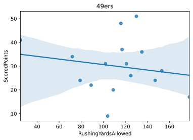


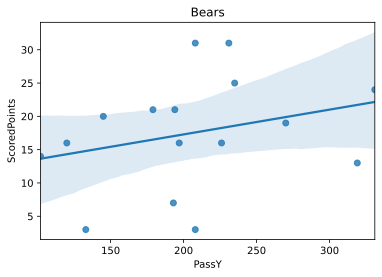


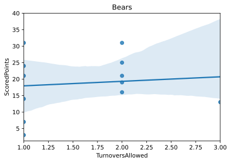


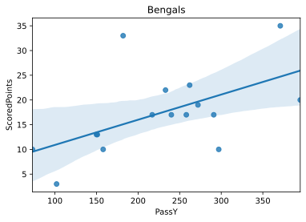


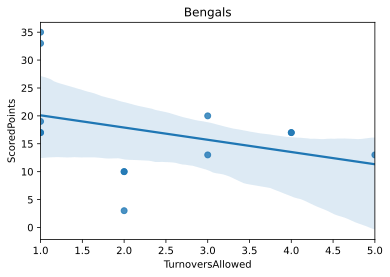


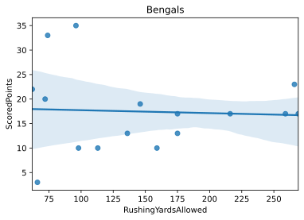


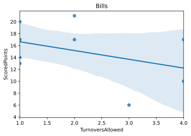


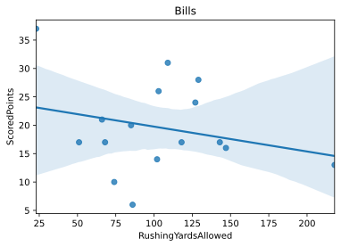


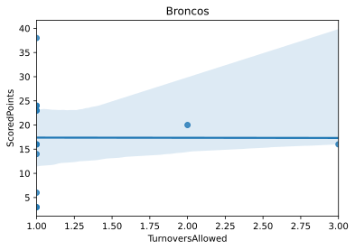


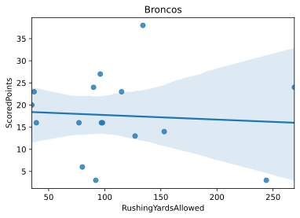


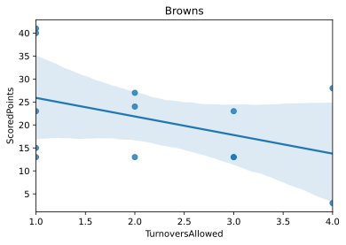


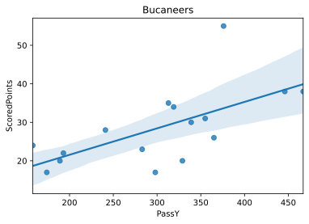


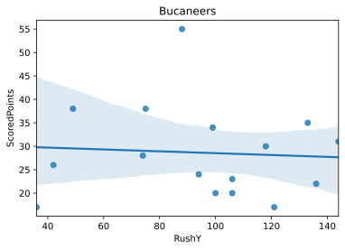


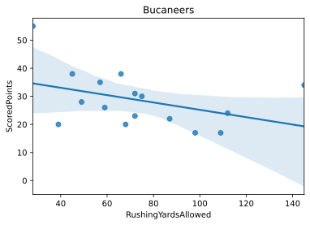


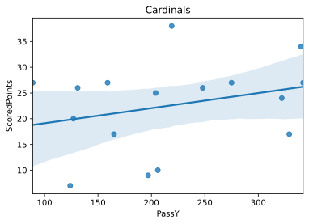


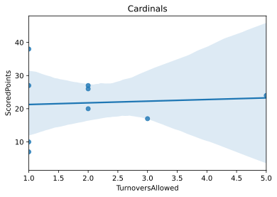


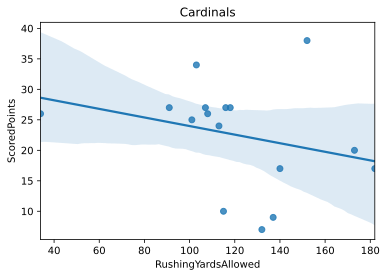


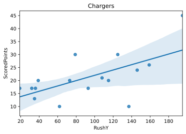


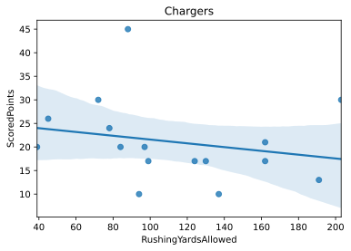


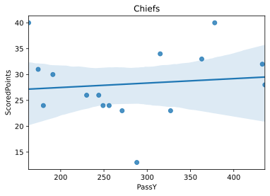


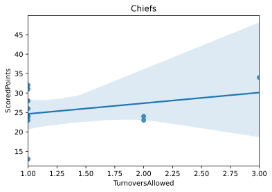


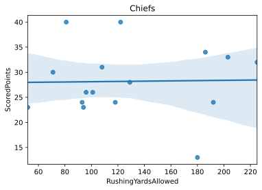


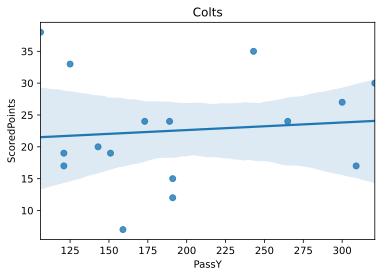


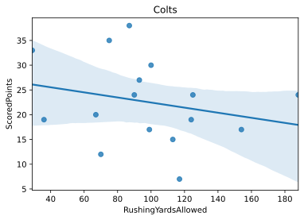


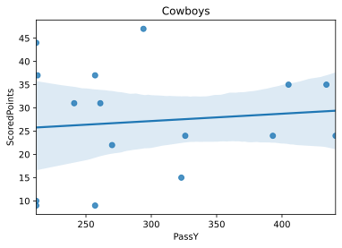


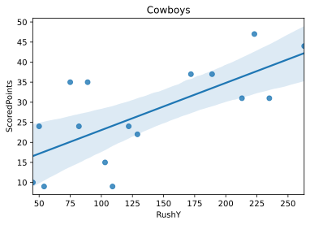


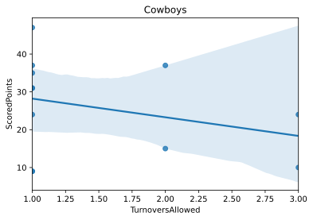


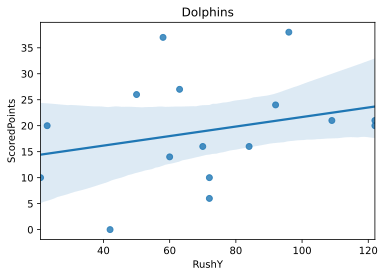


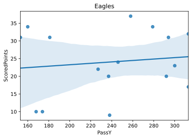


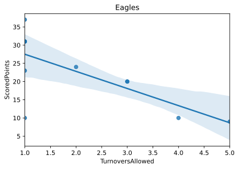


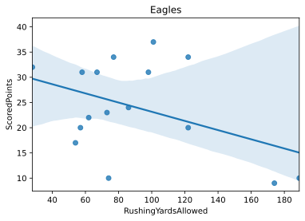


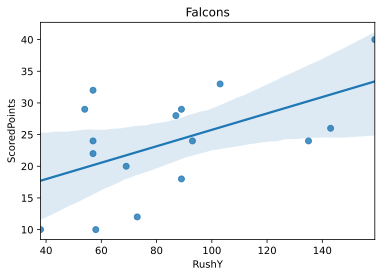


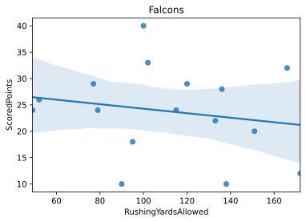


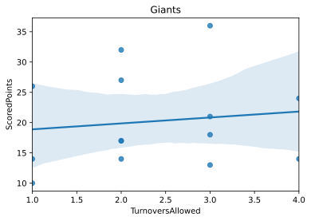


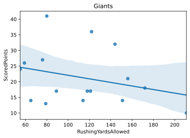


```python
#Plotting combined statistics across all teams

Pass_Yards = sns.lmplot(x= 'PassY', y= 'ScoredPoints', palette= sns.color_palette("Paired"), hue= 'Team Name',data= team_stats_init, height= 8, fit_reg= False)
sns.regplot(x="PassY", y="ScoredPoints", data=team_stats_init, scatter=False, ax= Pass_Yards.axes[0, 0], line_kws={"color": "black"})
plt.xlabel("Passing Yards")
plt.ylabel("Points Scored")
plt.title("Points Scored vs Pass Yards Across All NFL Teams in the 2019 Season")

Rush_Yards = sns.lmplot(x= 'RushY', y= 'ScoredPoints', palette= sns.color_palette("Paired"), hue= 'Team Name',data= team_stats_init, height= 8, fit_reg= False)
sns.regplot(x="RushY", y="ScoredPoints", data=team_stats_init, scatter=False, ax= Rush_Yards.axes[0, 0], line_kws={"color": "black"})
plt.xlabel("Rushing Yards")
plt.ylabel("Points Scored")
plt.title("Points Scored vs Rush Yards Across All NFL Teams in the 2019 Season")

Turnovers_Allowed = sns.lmplot(x= 'TurnoversAllowed', y= 'ScoredPoints', palette= sns.color_palette("Paired"), hue= 'Team Name',data= team_stats_init, height= 8, fit_reg= False)
sns.regplot(x="TurnoversAllowed", y="ScoredPoints", data=team_stats_init, scatter=False, ax= Turnovers_Allowed.axes[0, 0], line_kws={"color": "black"})
plt.xlabel("Turnovers Allowed")
plt.ylabel("Points Scored")
plt.title("Points Scored vs Turnovers Allowed Across All NFL Teams in the 2019 Season")

Rushing_Yards_Allowed = sns.lmplot(x= 'RushingYardsAllowed', y= 'ScoredPoints', palette= sns.color_palette("Paired"), hue= 'Team Name',data= team_stats_init, height= 8, fit_reg= False)
sns.regplot(x="RushingYardsAllowed", y="ScoredPoints", data=team_stats_init, scatter=False, ax= Rushing_Yards_Allowed.axes[0, 0], line_kws={"color": "black"})
plt.xlabel("Rushing Yards Allowed")
plt.ylabel("Points Scored")
plt.title("Points Scored vs Rushing Yards Allowed Across All NFL Teams in the 2019 Season")

```


    Text(0.5, 1.0, 'Points Scored vs Rushing Yards Allowed Across All NFL Teams in the 2019 Season')


```python
test_train_data = pd.DataFrame(columns=['Team Name', 'Scored Points', 'Expected Pass Yards'])
for title, group in team_stats_init.groupby('Team Name'):
  
    series = group.iloc[:, 4:5]
    values = pd.DataFrame(series.values)
    averages = {}
    lst = []
    add_to_subset = {}
    for index in range(values.shape[0]):
        if index > 0:
            ele = values.iloc[:index, :].mean(numeric_only= True)
            lst.append(ele.values[0])
        else:
            lst.append(0)

    averages[0] = lst
    averages = pd.DataFrame(averages)
    averages.replace(0, np.nan, inplace=True)
    averages.columns = ['Expected Pass Yards']

    add_to_subset['Team Name'] = [title] * 17
    add_to_subset = pd.DataFrame(add_to_subset, columns = ["Team Name"])
    add_to_subset['Scored Points'] = group['ScoredPoints'].values
    add_to_subset['Expected Pass Yards'] = averages['Expected Pass Yards']
    
    test_train_data = pd.concat([test_train_data, add_to_subset], ignore_index = True)
    
    


```


```python
rushing_column = pd.DataFrame(columns= ["Expected Rushing Yards"])
for title, group in team_stats_init.groupby('Team Name'):
  
    series = group.iloc[:, 5:6]
    values = pd.DataFrame(series.values)
    averages = {}
    lst = []
    add_to_subset = {}
    for index in range(values.shape[0]):
        if index > 0:
            ele = values.iloc[:index, :].mean(numeric_only= True)
            lst.append(ele.values[0])
        else:
            lst.append(0)

    averages[0] = lst
    averages = pd.DataFrame(averages)
    averages.replace(0, np.nan, inplace=True)
    averages.columns = ['Expected Rushing Yards']
    add_to_subset['Expected Rushing Yards'] = averages['Expected Rushing Yards'].values
    
    add_to_subset = pd.DataFrame(add_to_subset, columns = ["Expected Rushing Yards"])

    rushing_column = pd.concat([rushing_column, add_to_subset])
    

test_train_data["Expected Rushing Yards"] = rushing_column['Expected Rushing Yards'].values


```


```python
rushing_column = pd.DataFrame(columns= ["Expected Turnovers Allowed"])
for title, group in team_stats_init.groupby('Team Name'):
  
    series = group.iloc[:, 6:7]
    values = pd.DataFrame(series.values)
    averages = {}
    lst = []
    add_to_subset = {}
    for index in range(values.shape[0]):
        if index > 0:
            ele = values.iloc[:index, :].mean(numeric_only= True)
            lst.append(ele.values[0])
        else:
            lst.append(0)

    averages[0] = lst
    averages = pd.DataFrame(averages)
    averages.replace(0, np.nan, inplace=True)
    averages.columns = ['Expected Turnovers Allowed']
    add_to_subset['Expected Turnovers Allowed'] = averages['Expected Turnovers Allowed'].values
    
    add_to_subset = pd.DataFrame(add_to_subset, columns = ["Expected Turnovers Allowed"])

    rushing_column = pd.concat([rushing_column, add_to_subset])
    

test_train_data["Expected Turnovers Allowed"] = rushing_column['Expected Turnovers Allowed'].values
```


```python
rushing_column = pd.DataFrame(columns= ["Expected Rushing Yards Allowed"])
for title, group in team_stats_init.groupby('Team Name'):
  
    series = group.iloc[:, 10:11]
    values = pd.DataFrame(series.values)
    averages = {}
    lst = []
    add_to_subset = {}
    for index in range(values.shape[0]):
        if index > 0:
            ele = values.iloc[:index, :].mean(numeric_only= True)
            lst.append(ele.values[0])
        else:
            lst.append(0)

    averages[0] = lst
    averages = pd.DataFrame(averages)
    averages.replace(0, np.nan, inplace=True)
    averages.columns = ['Expected Rushing Yards Allowed']
    add_to_subset['Expected Rushing Yards Allowed'] = averages['Expected Rushing Yards Allowed'].values
    
    add_to_subset = pd.DataFrame(add_to_subset, columns = ["Expected Rushing Yards Allowed"])

    rushing_column = pd.concat([rushing_column, add_to_subset])
    

test_train_data["Expected Rushing Yards Allowed"] = rushing_column['Expected Rushing Yards Allowed'].values
test_train_data.to_csv(r"data_for_models/test_train_data.csv")
test_train_data.head(17)
```


<div>
<style scoped>
    .dataframe tbody tr th:only-of-type {
        vertical-align: middle;
    }

    .dataframe tbody tr th {
        vertical-align: top;
    }

    .dataframe thead th {
        text-align: right;
    }
</style>
<table border="1" class="dataframe">
  <thead>
    <tr style="text-align: right;">
      <th></th>
      <th>Team Name</th>
      <th>Scored Points</th>
      <th>Expected Pass Yards</th>
      <th>Expected Rushing Yards</th>
      <th>Expected Turnovers Allowed</th>
      <th>Expected Rushing Yards Allowed</th>
    </tr>
  </thead>
  <tbody>
    <tr>
      <th>0</th>
      <td>49ers</td>
      <td>31.0</td>
      <td>NaN</td>
      <td>NaN</td>
      <td>NaN</td>
      <td>NaN</td>
    </tr>
    <tr>
      <th>1</th>
      <td>49ers</td>
      <td>41.0</td>
      <td>158.000000</td>
      <td>98.000000</td>
      <td>2.000000</td>
      <td>121.000000</td>
    </tr>
    <tr>
      <th>2</th>
      <td>49ers</td>
      <td>24.0</td>
      <td>235.000000</td>
      <td>178.500000</td>
      <td>1.500000</td>
      <td>73.000000</td>
    </tr>
    <tr>
      <th>3</th>
      <td>49ers</td>
      <td>NaN</td>
      <td>246.000000</td>
      <td>175.000000</td>
      <td>2.666667</td>
      <td>75.000000</td>
    </tr>
    <tr>
      <th>4</th>
      <td>49ers</td>
      <td>31.0</td>
      <td>246.000000</td>
      <td>175.000000</td>
      <td>2.666667</td>
      <td>75.000000</td>
    </tr>
    <tr>
      <th>5</th>
      <td>49ers</td>
      <td>20.0</td>
      <td>227.250000</td>
      <td>200.000000</td>
      <td>2.666667</td>
      <td>81.750000</td>
    </tr>
    <tr>
      <th>6</th>
      <td>49ers</td>
      <td>9.0</td>
      <td>228.200000</td>
      <td>179.800000</td>
      <td>2.500000</td>
      <td>87.200000</td>
    </tr>
    <tr>
      <th>7</th>
      <td>49ers</td>
      <td>51.0</td>
      <td>214.500000</td>
      <td>172.666667</td>
      <td>2.200000</td>
      <td>90.000000</td>
    </tr>
    <tr>
      <th>8</th>
      <td>49ers</td>
      <td>28.0</td>
      <td>206.142857</td>
      <td>181.142857</td>
      <td>2.000000</td>
      <td>95.714286</td>
    </tr>
    <tr>
      <th>9</th>
      <td>49ers</td>
      <td>24.0</td>
      <td>219.125000</td>
      <td>171.125000</td>
      <td>2.000000</td>
      <td>102.875000</td>
    </tr>
    <tr>
      <th>10</th>
      <td>49ers</td>
      <td>36.0</td>
      <td>218.666667</td>
      <td>161.777778</td>
      <td>2.142857</td>
      <td>107.777778</td>
    </tr>
    <tr>
      <th>11</th>
      <td>49ers</td>
      <td>37.0</td>
      <td>237.600000</td>
      <td>149.000000</td>
      <td>2.125000</td>
      <td>110.500000</td>
    </tr>
    <tr>
      <th>12</th>
      <td>49ers</td>
      <td>17.0</td>
      <td>236.636364</td>
      <td>145.636364</td>
      <td>2.125000</td>
      <td>111.090909</td>
    </tr>
    <tr>
      <th>13</th>
      <td>49ers</td>
      <td>48.0</td>
      <td>230.000000</td>
      <td>148.000000</td>
      <td>2.000000</td>
      <td>116.666667</td>
    </tr>
    <tr>
      <th>14</th>
      <td>49ers</td>
      <td>22.0</td>
      <td>239.538462</td>
      <td>149.076923</td>
      <td>1.900000</td>
      <td>116.615385</td>
    </tr>
    <tr>
      <th>15</th>
      <td>49ers</td>
      <td>34.0</td>
      <td>236.214286</td>
      <td>147.000000</td>
      <td>1.909091</td>
      <td>114.642857</td>
    </tr>
    <tr>
      <th>16</th>
      <td>49ers</td>
      <td>26.0</td>
      <td>234.800000</td>
      <td>145.133333</td>
      <td>1.916667</td>
      <td>111.800000</td>
    </tr>
  </tbody>
</table>
</div>


```python
test_train_data.fillna(test_train_data.mean(), inplace=True)


X = test_train_data[["Expected Pass Yards", "Expected Rushing Yards", "Expected Turnovers Allowed", "Expected Rushing Yards Allowed"]]
y = np.ravel(test_train_data[['Scored Points']])
X_train, X_test, y_train, y_test = train_test_split(X,y,random_state = 0)
clf = RandomForestRegressor(max_depth=1000, random_state=1)

clf.fit(X_train, y_train)
score_train = mean_squared_error(y_test, clf.predict(X_test))

print(score_train)


```

    89.50317158558929


```python
p1 = sns.regplot(x = y_test, y= clf.predict(X_test))
plt.xlabel("Expected")
plt.ylabel("Predicted")
plt.title("Predicted Score vs. Expected Score")
```


    Text(0.5, 1.0, 'Predicted Score vs. Expected Score')


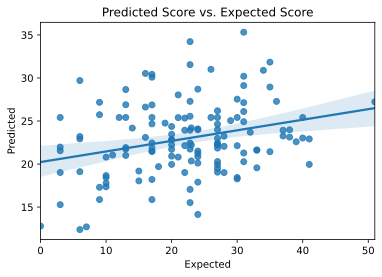


```python
final_df = pd.DataFrame(columns= ["ExpectedPointsScored", "ActualPointsScored"])
final_df['ExpectedPointsScored'] = clf.predict(X_test)
final_df['ActualPointsScored'] = y_test
lin_reg_test = statsmodels.formula.api.ols(formula="ExpectedPointsScored ~ ActualPointsScored", data=final_df).fit()
print(lin_reg_test.summary())
```

                                 OLS Regression Results                             
    ================================================================================
    Dep. Variable:     ExpectedPointsScored   R-squared:                       0.081
    Model:                              OLS   Adj. R-squared:                  0.074
    Method:                   Least Squares   F-statistic:                     11.75
    Date:                  Thu, 17 Dec 2020   Prob (F-statistic):           0.000807
    Time:                          20:09:57   Log-Likelihood:                -382.51
    No. Observations:                   136   AIC:                             769.0
    Df Residuals:                       134   BIC:                             774.8
    Df Model:                             1                                         
    Covariance Type:              nonrobust                                         
    ======================================================================================
                             coef    std err          t      P>|t|      [0.025      0.975]
    --------------------------------------------------------------------------------------
    Intercept             20.2314      0.865     23.383      0.000      18.520      21.943
    ActualPointsScored     0.1229      0.036      3.428      0.001       0.052       0.194
    ==============================================================================
    Omnibus:                        3.979   Durbin-Watson:                   2.022
    Prob(Omnibus):                  0.137   Jarque-Bera (JB):                3.643
    Skew:                           0.398   Prob(JB):                        0.162
    Kurtosis:                       3.098   Cond. No.                         60.1
    ==============================================================================
    
    Notes:
    [1] Standard Errors assume that the covariance matrix of the errors is correctly specified.


```python
final_df.head(20)

```


<div>
<style scoped>
    .dataframe tbody tr th:only-of-type {
        vertical-align: middle;
    }

    .dataframe tbody tr th {
        vertical-align: top;
    }

    .dataframe thead th {
        text-align: right;
    }
</style>
<table border="1" class="dataframe">
  <thead>
    <tr style="text-align: right;">
      <th></th>
      <th>ExpectedPointsScored</th>
      <th>ActualPointsScored</th>
    </tr>
  </thead>
  <tbody>
    <tr>
      <th>0</th>
      <td>14.140521</td>
      <td>24.0000</td>
    </tr>
    <tr>
      <th>1</th>
      <td>31.840000</td>
      <td>35.0000</td>
    </tr>
    <tr>
      <th>2</th>
      <td>22.986875</td>
      <td>27.0000</td>
    </tr>
    <tr>
      <th>3</th>
      <td>18.202188</td>
      <td>17.0000</td>
    </tr>
    <tr>
      <th>4</th>
      <td>22.822510</td>
      <td>20.0000</td>
    </tr>
    <tr>
      <th>5</th>
      <td>19.958125</td>
      <td>20.0000</td>
    </tr>
    <tr>
      <th>6</th>
      <td>21.972717</td>
      <td>3.0000</td>
    </tr>
    <tr>
      <th>7</th>
      <td>19.920000</td>
      <td>27.0000</td>
    </tr>
    <tr>
      <th>8</th>
      <td>17.050000</td>
      <td>22.8125</td>
    </tr>
    <tr>
      <th>9</th>
      <td>15.277917</td>
      <td>3.0000</td>
    </tr>
    <tr>
      <th>10</th>
      <td>21.509350</td>
      <td>24.0000</td>
    </tr>
    <tr>
      <th>11</th>
      <td>20.802708</td>
      <td>10.0000</td>
    </tr>
    <tr>
      <th>12</th>
      <td>18.438125</td>
      <td>30.0000</td>
    </tr>
    <tr>
      <th>13</th>
      <td>29.700000</td>
      <td>6.0000</td>
    </tr>
    <tr>
      <th>14</th>
      <td>19.560625</td>
      <td>33.0000</td>
    </tr>
    <tr>
      <th>15</th>
      <td>20.290771</td>
      <td>27.0000</td>
    </tr>
    <tr>
      <th>16</th>
      <td>21.848625</td>
      <td>27.0000</td>
    </tr>
    <tr>
      <th>17</th>
      <td>28.950000</td>
      <td>35.0000</td>
    </tr>
    <tr>
      <th>18</th>
      <td>22.056094</td>
      <td>28.0000</td>
    </tr>
    <tr>
      <th>19</th>
      <td>21.734870</td>
      <td>22.8125</td>
    </tr>
  </tbody>
</table>
</div>


```python

```
